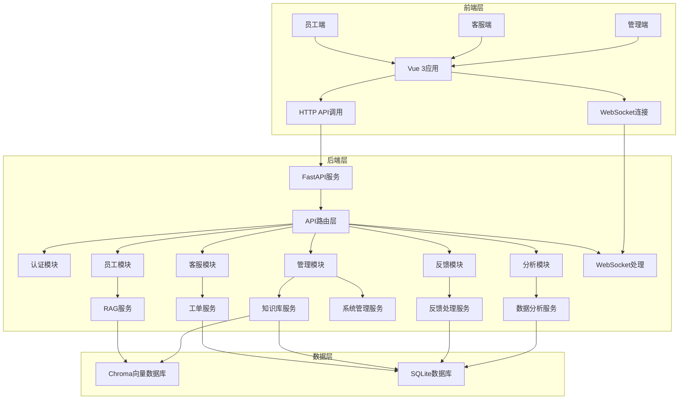

# IT智能客服系统（企业版）

[](https://github.com/HYFLLLo/IT-Intelligent-Customer-Service-System)
[](https://github.com/HYFLLLo/IT-Intelligent-Customer-Service-System)

## 项目简介

IT智能客服系统是基于AI技术的企业级IT支持解决方案，旨在通过人工智能技术自动处理常见IT问题，提升客服效率，实现IT支持的智能化转型。系统集成了大语言模型、向量数据库、智能工单管理等核心技术，为企业提供一站式的IT支持服务。

### 核心功能

- **智能问答**：基于RAG技术的自然语言理解和生成，自动回答员工的IT问题
- **工单管理**：支持工单创建、分配、处理和关闭，集成AI辅助功能
- **知识库管理**：智能管理IT知识文档，支持文档添加、更新和检索
- **用户反馈**：收集和分析用户反馈，持续优化系统性能
- **数据分析**：多维度分析系统运行数据，提供智能决策支持
- **系统管理**：基于角色的权限管理，确保系统安全稳定运行

## 技术架构

### 后端技术栈

| 技术 | 版本 | 用途 |
|------|------|------|
| Python | 3.9+ | 后端开发语言 |
| FastAPI | 最新版 | RESTful API框架 |
| SQLite | 最新版 | 关系型数据库 |
| ChromaDB | 最新版 | 向量数据库（知识检索） |
| Pydantic | 最新版 | 数据验证和序列化 |
| JWT | 最新版 | 用户认证 |

### 前端技术栈

| 技术 | 版本 | 用途 |
|------|------|------|
| Vue.js | 3.5+ | 前端框架 |
| TypeScript | 5.9+ | 类型系统 |
| Element Plus | 2.13+ | UI组件库 |
| Pinia | 3.0+ | 状态管理 |
| Vue Router | 5.0+ | 前端路由 |
| Vite | 7.2+ | 构建工具 |

### 系统架构图



## 项目结构

```
it-intelligent-customer-service-system/
├── backend/            # 后端代码
│   ├── app/            # 应用核心代码
│   │   ├── api/        # API路由
│   │   │   └── v1/     # v1版本API
│   │   ├── config/     # 配置管理
│   │   ├── models/     # 数据模型
│   │   ├── services/   # 业务逻辑服务
│   │   ├── utils/      # 工具函数
│   │   └── websocket/  # WebSocket处理
│   ├── chromadb/       # 向量数据库存储
│   ├── main.py         # 应用入口
│   ├── requirements.txt # 依赖文件
│   └── test.db         # SQLite数据库
├── frontend/           # 前端代码
│   ├── src/            # 源代码
│   │   ├── components/ # 组件
│   │   ├── views/      # 页面
│   │   ├── router/     # 路由
│   │   ├── store/      # 状态管理
│   │   └── api/        # API调用
│   ├── package.json    # 依赖配置
│   └── vite.config.ts  # Vite配置
├── 产品需求文档(PRD).md # 产品需求文档
├── 技术需求文档(TRD).md # 技术需求文档
└── README.md           # 项目说明
```

## 快速开始

### 环境要求

- Python 3.9+
- Node.js 18+
- npm 9+

### 1. 克隆项目

```bash
git clone https://github.com/HYFLLLo/IT-Intelligent-Customer-Service-System.git
cd IT-Intelligent-Customer-Service-System
```

### 2. 后端部署

#### 2.1 安装依赖

```bash
cd backend
pip install -r requirements.txt
```

#### 2.2 配置环境变量

创建 `.env` 文件并添加以下内容：

```env
# 数据库配置
DATABASE_URL=sqlite:///./test.db

# 认证配置
SECRET_KEY=your_secret_key_here
ALGORITHM=HS256
ACCESS_TOKEN_EXPIRE_MINUTES=30

# 应用配置
APP_NAME="IT Intelligent Customer Service System"
DEBUG=True
```

#### 2.3 初始化数据库

```bash
python init_db.py
```

#### 2.4 启动后端服务

```bash
python main.py
```

服务将在 `http://localhost:8000` 启动。

### 3. 前端部署

#### 3.1 安装依赖

```bash
cd ../frontend
npm install
```

#### 3.2 启动前端服务

```bash
npm run dev
```

服务将在 `http://localhost:5173` 启动。

## API文档

后端提供了完整的API文档，可通过以下地址访问：

```
http://localhost:8000/docs
```

API文档使用OpenAPI规范，包含所有可用的API接口、请求参数和响应格式。

## 核心功能模块

### 1. 智能问答（RAG）

- **功能**：基于大语言模型和向量数据库的智能问答系统
- **原理**：
  1. 接收用户问题
  2. 从向量数据库检索相关知识
  3. 结合检索结果生成回答
  4. 评估回答置信度
  5. 返回回答和相关建议
- **应用**：员工端智能问答界面

### 2. 工单管理

- **功能**：全生命周期工单管理
- **流程**：
  1. 工单创建（自动/手动）
  2. 工单分配（自动/手动）
  3. 工单处理（AI辅助）
  4. 工单关闭
  5. 工单分析
- **特点**：支持优先级管理、状态跟踪、AI辅助处理

### 3. 知识库管理

- **功能**：智能管理IT知识文档
- **特性**：
  - 文档添加、更新、删除
  - 文档分类管理
  - 向量检索
  - 版本控制
- **应用**：为智能问答提供知识支持

### 4. 反馈系统

- **功能**：收集和分析用户反馈
- **流程**：
  1. 接收用户反馈
  2. 分析反馈内容
  3. 生成反馈报告
  4. 提供改进建议
- **应用**：持续优化系统性能和用户体验

### 5. 数据分析

- **功能**：多维度分析系统运行数据
- **分析维度**：
  - 工单数据分析
  - 问题热点分析
  - 用户满意度分析
  - 系统性能分析
- **应用**：为管理层提供决策支持

## 系统安全

- **认证机制**：基于JWT的无状态认证
- **权限控制**：基于角色的访问控制（RBAC）
- **数据加密**：敏感数据加密存储
- **API安全**：请求验证和限流
- **日志审计**：系统操作日志记录

## 部署与维护

### 开发环境

- **后端**：使用 `python main.py` 启动开发服务器
- **前端**：使用 `npm run dev` 启动开发服务器

### 生产环境

- **后端**：使用Gunicorn或Uvicorn部署
- **前端**：使用 `npm run build` 构建生产版本
- **数据库**：建议使用更强大的数据库如PostgreSQL
- **监控**：建议集成Prometheus和Grafana进行系统监控

### 常见问题

1. **数据库连接失败**：检查 `.env` 文件中的数据库配置
2. **API调用失败**：检查后端服务是否运行，查看控制台错误信息
3. **前端页面空白**：检查前端依赖是否安装完整，查看浏览器控制台错误信息
4. **向量数据库初始化失败**：检查ChromaDB依赖是否安装，确保有足够的磁盘空间

## 技术文档

- **产品需求文档**：[产品需求文档(PRD).md](产品需求文档(PRD).md)
- **技术需求文档**：[技术需求文档(TRD).md](技术需求文档(TRD).md)

## 贡献指南

### 开发流程

1. **Fork项目**：在GitHub上Fork本项目
2. **创建分支**：从 `master` 分支创建新的功能分支
3. **开发功能**：在新分支上开发功能
4. **提交代码**：使用清晰的提交消息提交代码
5. **创建PR**：在GitHub上创建Pull Request

### 代码规范

- **后端**：遵循PEP 8代码规范
- **前端**：遵循ESLint和Prettier代码规范
- **提交消息**：使用清晰、简洁的提交消息

## 许可证

本项目采用MIT许可证。详见 [LICENSE](LICENSE) 文件。

## 联系方式

- **项目地址**：[https://github.com/HYFLLLo/IT-Intelligent-Customer-Service-System](https://github.com/HYFLLLo/IT-Intelligent-Customer-Service-System)

---

**感谢使用IT智能客服系统！** 如有任何问题或建议，欢迎提交Issue或Pull Request。