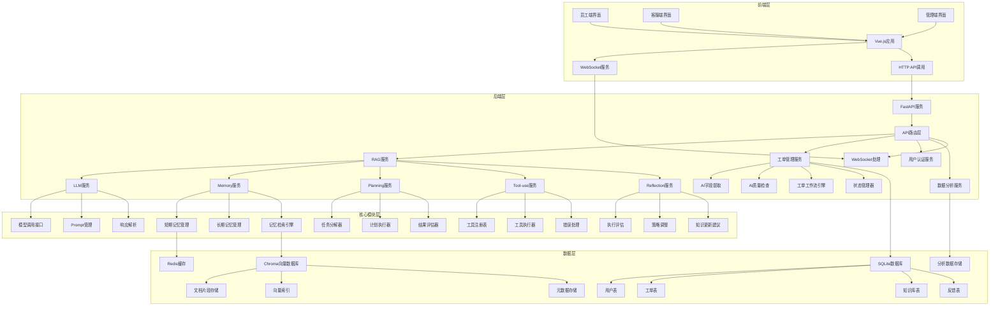

# IT智能客服系统（企业版）

[](https://github.com/HYFLLLo/IT-Intelligent-Customer-Service-System)
[](https://github.com/HYFLLLo/IT-Intelligent-Customer-Service-System)

## 项目简介

IT智能客服系统是基于AI Agent技术的企业级IT支持解决方案，旨在通过人工智能技术自动处理常见IT问题，提升客服效率，实现IT支持的智能化转型。系统集成了大语言模型、向量数据库、智能工单管理等核心技术，为企业提供一站式的IT支持服务。

### 核心价值

- **提高效率**：AI自动处理常见问题，减少人工干预，客服处理效率提升60%
- **降低成本**：AI直接解决的问题占比≥70%，工单创建率降低≥50%
- **提升体验**：平均响应时间<3秒，用户满意度≥4.5（5分制）
- **知识沉淀**：自动积累和管理IT知识，知识库覆盖率≥90%
- **智能决策**：基于数据分析提供智能决策支持，优化IT支持流程

## 功能特性

### 1. 智能问答
- 基于大语言模型的自然语言理解和生成
- 混合检索（向量检索+关键词匹配），知识库检索准确率≥90%
- 个性化解决方案生成，适应不同用户角色
- 置信度评估，智能判断直接回答或建议创建工单
- 多轮对话支持，保持上下文连贯性

### 2. 工单管理
- 自动或手动创建IT支持工单
- AI自动提取关键字段，提取准确率≥85%
- 基于工单类型、优先级和客服负载自动分配
- 工单状态跟踪和更新，支持状态变更通知
- 工单处理完成后自动生成质检报告

### 3. 知识库管理
- 支持文档添加、更新、删除和分类管理
- 自动分析文档内容，提取关键词和摘要
- 检测文档中的重复内容和过时信息
- 支持批量文档处理，自动清洗和标准化
- 版本控制，记录知识库的历史版本

### 4. AI质量检查
- 评估AI生成回答的质量和准确性，评分准确率≥90%
- 评估客服回复的质量和完整性，评分准确率≥90%
- 生成详细的质检报告，包括评分和改进建议
- 分析质量趋势，提供可视化报表和改进建议
- 质量预警，当质量指标低于阈值时自动预警

### 5. 数据分析
- 多维度工单数据分析，包括数量、类型、处理时间等
- 问题热点分析，识别常见问题和热点话题
- 系统性能分析，监控响应时间、准确率等指标
- 用户满意度分析，分析反馈和评分
- 预测分析，基于历史数据预测未来IT问题趋势

### 6. 系统管理
- 基于角色的用户权限管理
- 系统配置和参数调整，支持配置版本控制
- 系统运行状态监控，包括CPU、内存、网络等
- 安全管理，包括认证、授权和加密
- 审计管理，记录系统操作审计日志

### 7. 集成管理
- 与企业内部CRM、ERP、监控系统等集成
- API管理，支持API密钥管理和访问控制
- Webhook管理，配置和管理外部系统事件

## 技术栈

| 分类 | 技术/框架 | 版本 | 用途 |
|------|-----------|------|------|
| **后端** | FastAPI | 0.104.1 | 提供RESTful API和WebSocket服务 |
| | Python | 3.9+ | 后端开发语言 |
| **前端** | Vue.js | 3.3.8 | 前端框架 |
| | TypeScript | 5.2.2 | 前端开发语言 |
| | Vite | 5.0.0 | 前端构建工具 |
| **AI** | DeepSeek API | latest | 大语言模型能力 |
| | ChromaDB | 0.4.18 | 向量数据库，知识检索 |
| **数据库** | SQLite | 3.40.0 | 关系型数据库，存储业务数据 |
| | Redis | 7.0+ | 缓存和会话管理 |
| **部署** | Docker | 20.10+ | 容器化部署 |
| | Docker Compose | 2.20.0 | 多容器编排 |

## 系统架构



## 快速开始

### 环境要求

- Python 3.9+
- Node.js 18+
- Docker (可选，用于容器化部署)

### 1. 克隆项目

```bash
git clone https://github.com/yourusername/it-intelligent-customer-service-system.git
cd it-intelligent-customer-service-system
```

### 2. 后端部署

#### 2.1 安装依赖

```bash
cd backend
pip install -r requirements.txt
```

#### 2.2 配置环境变量

创建 `.env` 文件并添加以下内容：

```env
# 数据库配置
DATABASE_URL=sqlite:///./test.db

# Chroma数据库配置
CHROMA_DB_PATH=./chromadb

# LLM配置
DEEPSEEK_API_KEY=your_deepseek_api_key
DEEPSEEK_MODEL=deepseek-chat

# 认证配置
SECRET_KEY=your_secret_key
ALGORITHM=HS256
ACCESS_TOKEN_EXPIRE_MINUTES=30

# 应用配置
APP_NAME="IT Intelligent Customer Service System"
DEBUG=True
```

#### 2.3 启动后端服务

```bash
uvicorn app.main:app --host 0.0.0.0 --port 8000 --reload
```

### 3. 前端部署

#### 3.1 安装依赖

```bash
cd ../frontend
npm install
```

#### 3.2 配置环境变量

创建 `.env` 文件并添加以下内容：

```env
VITE_API_URL=http://localhost:8000
VITE_WS_URL=ws://localhost:8000/ws
```

#### 3.3 启动前端服务

```bash
npm run dev
```

### 4. 访问系统

- 员工端：`http://localhost:5173/employee`
- 客服端：`http://localhost:5173/customer-service`
- 管理端：`http://localhost:5173/admin`
- API文档：`http://localhost:8000/docs`

## 使用指南

### 1. 智能问答

1. **访问员工端**：打开浏览器，访问 `http://localhost:5173/employee`
2. **输入问题**：在问题输入框中描述你的IT问题，例如 "我的电脑无法开机"
3. **获取回答**：系统会自动分析问题并生成解决方案
4. **执行解决方案**：按照系统提供的步骤操作
5. **提供反馈**：问题解决后，对解决方案进行1-5分评价

### 2. 工单管理

1. **访问客服端**：打开浏览器，访问 `http://localhost:5173/customer-service`
2. **查看工单**：在工单列表中查看待处理的工单
3. **处理工单**：点击工单查看详情，参考AI建议编辑回复
4. **提交回复**：编辑完成后点击发送按钮
5. **关闭工单**：问题解决后点击关闭按钮，系统会自动生成质检报告

### 3. 知识库管理

1. **访问管理端**：打开浏览器，访问 `http://localhost:5173/admin`
2. **进入知识库管理**：在左侧菜单中点击 "知识库管理"
3. **添加文档**：点击 "添加文档" 按钮，填写文档标题、分类和内容
4. **更新文档**：在文档列表中选择要更新的文档，点击 "编辑" 按钮
5. **删除文档**：在文档列表中选择要删除的文档，点击 "删除" 按钮

### 4. 数据分析

1. **访问管理端**：打开浏览器，访问 `http://localhost:5173/admin`
2. **进入数据分析**：在左侧菜单中点击 "数据分析"
3. **查看报表**：选择要查看的报表类型，如 "工单数据分析"、"问题热点分析" 等
4. **导出报表**：点击 "导出" 按钮，将报表导出为Excel或PDF格式

## 项目结构

```
it-intelligent-customer-service-system/
├── backend/            # 后端代码
│   ├── app/
│   │   ├── api/        # API路由
│   │   ├── services/   # 业务逻辑
│   │   │   ├── rag/     # RAG相关服务
│   │   │   ├── ticket/  # 工单管理服务
│   │   │   ├── knowledge/ # 知识库管理服务
│   │   │   ├── quality/  # 质量检查服务
│   │   │   └── analytics/ # 数据分析服务
│   │   ├── models/     # 数据模型
│   │   ├── schemas/    # 数据校验和序列化
│   │   ├── config/     # 配置管理
│   │   └── utils/      # 工具函数
│   ├── requirements.txt # 依赖文件
│   └── main.py         # 应用入口
├── frontend/           # 前端代码
│   ├── src/
│   │   ├── components/ # 组件
│   │   ├── views/      # 页面
│   │   ├── router/     # 路由
│   │   ├── store/      # 状态管理
│   │   ├── api/        # API调用
│   │   └── utils/      # 工具函数
│   ├── package.json    # 依赖文件
│   └── vite.config.ts  # Vite配置
├── docs/               # 文档
│   ├── 技术需求文档(TRD).md
│   └── 产品需求文档(PRD).md
└── README.md           # 项目说明
```

## 贡献指南

### 开发流程

1. **Fork 项目**：在GitHub上Fork本项目到你的个人账号
2. **创建分支**：从 `main` 分支创建新的功能分支
   ```bash
   git checkout -b feature/your-feature-name
   ```
3. **提交更改**：编写代码并提交更改
   ```bash
   git add .
   git commit -m "feat: 添加新功能"
   ```
4. **推送分支**：将分支推送到你的Fork
   ```bash
   git push origin feature/your-feature-name
   ```
5. **创建PR**：在GitHub上创建Pull Request，描述你的更改

### 代码规范

- **后端**：遵循PEP 8代码规范，使用Black进行代码格式化
- **前端**：遵循ESLint和Prettier代码规范
- **提交信息**：使用Conventional Commits格式
  ```
  <类型>(<范围>): <描述>
  
  <详细描述>
  
  <脚注>
  ```

### 测试

- **后端**：使用Pytest进行单元测试和集成测试
- **前端**：使用Vitest进行单元测试和组件测试
- **CI/CD**：提交代码时自动运行测试和代码检查

## 许可证

本项目采用MIT许可证。详见 [LICENSE](LICENSE) 文件。

## 联系方式

- **项目维护者**：HYFLLLo
- **邮箱**：huyufeng227@163.com
- **GitHub**：[HYFLLLo](https://github.com/HYFLLLo)

---

**感谢使用IT智能客服系统！** 如有任何问题或建议，欢迎提交Issue或Pull Request。