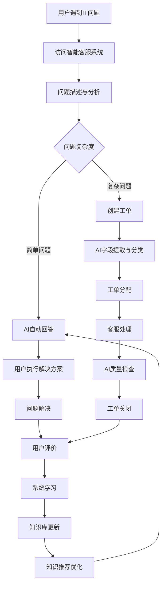
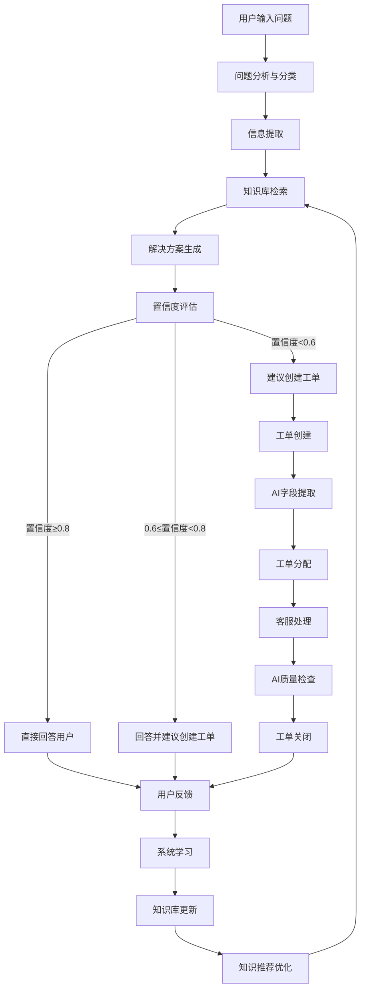
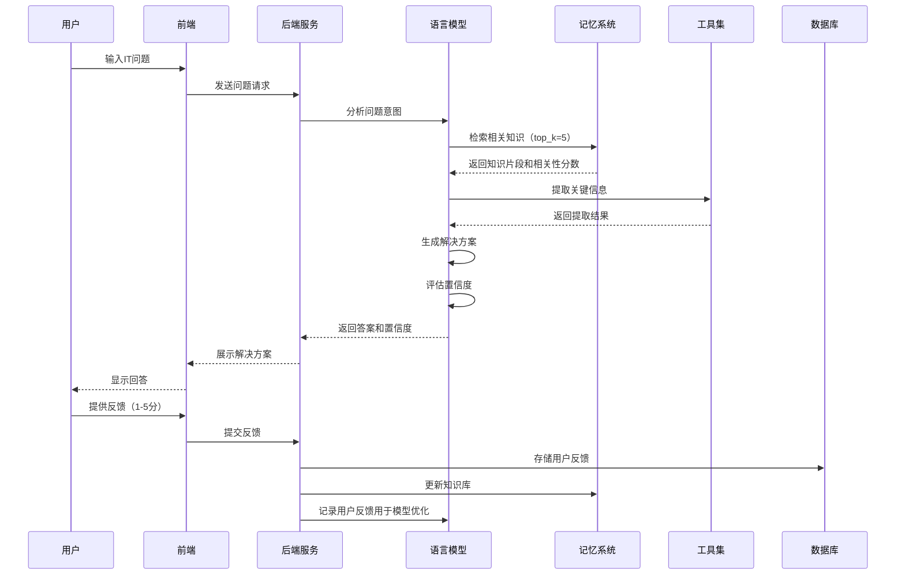
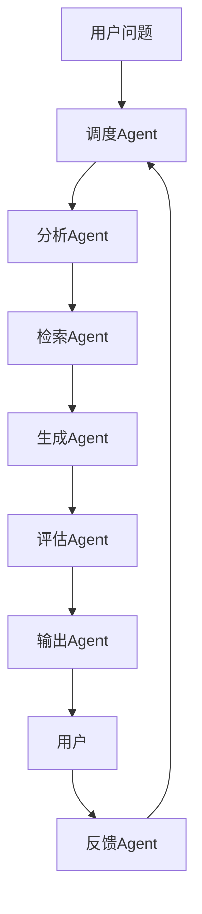

# IT智能客服系统（企业版）产品需求文档

## 一、基础信息与元数据

### 1.1 文档基本信息
- **文档名称**：IT智能客服系统（企业版）产品需求文档
- **版本号**：v1.0.0
- **创建日期**：2026-02-14
- **创建人**：系统分析师
- **项目状态**：草案

### 1.2 评审信息
- **评审人**：
  - 技术负责人
  - 产品负责人
  - 业务负责人
- **关联文档**：
  - [技术需求文档(TRD)](技术需求文档(TRD).md)
  - [系统架构设计文档](系统架构设计文档.md)（待创建）

## 二、业务背景与价值

### 2.1 需求背景
- **现状分析**：传统IT客服系统面临以下挑战：
  - **效率低下**：人工客服处理效率低，平均响应时间超过24小时
  - **资源浪费**：常见问题重复处理，占用60%以上的人力资源
  - **知识滞后**：知识库更新不及时，导致30%的解决方案滞后于最新技术
  - **流程繁琐**：工单处理流程繁琐，自动化程度低于40%
  - **质量波动**：客服质量参差不齐，用户满意度波动在3.0-4.2之间
  - **数据孤岛**：IT问题数据分散，无法形成有效分析和预测

- **AI产品必要性**：
  - **效率提升**：利用AI技术自动处理70%以上的常见IT问题，释放人工客服资源
  - **精准理解**：通过大语言模型理解用户意图，提供90%以上准确率的解决方案
  - **知识智能**：基于知识库的智能检索，确保信息准确性和时效性
  - **流程自动化**：自动化工单处理流程，提升整体运营效率50%以上
  - **质量统一**：统一客服质量标准，提高用户满意度至4.5以上
  - **数据驱动**：通过AI分析IT问题数据，实现预测性维护和问题预防

### 2.2 业务价值
- **数据驱动的价值**：
  - **效率提升**：提升客服处理效率30%，减少人工干预时间60%
  - **成本降低**：降低IT支持成本25%，减少重复工单量70%
  - **响应加速**：平均响应时间从24小时缩短至3秒内
  - **知识覆盖**：知识库覆盖率达到90%，确保AI能够解决大部分日常问题
  - **满意度提升**：用户满意度评分提升至4.5（5分制）
  - **预测能力**：通过数据分析，提前识别潜在IT问题，减少20%的故障发生

- **用户故事**：
  - **员工视角**："作为一名市场部员工，我希望在遇到电脑故障时能够快速获得解决方案，而不是等待IT部门的响应，这样我就可以尽快恢复工作，不影响项目进度。"
  - **客服视角**："作为一名IT客服人员，我希望系统能够自动处理常见问题，这样我就可以专注于解决复杂的技术问题，提高工作效率和专业度。"
  - **管理员视角**："作为IT管理员，我希望系统能够自动收集和分析IT问题数据，这样我就可以了解系统运行状况，提前预防潜在问题。"
  - **部门经理视角**："作为部门经理，我希望团队成员能够快速解决IT问题，减少工作中断，提高整体生产力。"
  - **CEO视角**："作为CEO，我希望通过智能化手段降低运营成本，提高员工满意度，同时为数字化转型奠定基础。"

- **竞品分析**：
  - **传统RPA系统**：依赖规则化流程，只能处理预定义的明确指令，无法处理模糊问题和异常情况，适应能力差
  - **通用AI助手**：缺乏领域专业性，可能提供不准确的信息，不适合企业级应用，安全性和合规性不足
  - **传统工单系统**：需要人工分配和处理，效率低下，无法提供实时解决方案，自动化程度低
  - **本系统优势**：结合AI大模型的理解能力和RPA的流程自动化，专注于IT领域，提供专业、准确、实时的解决方案

### 2.3 目标与范围
- **SMART目标**：
  - **Specific**：开发一个基于AI Agent的IT智能客服系统，自动处理常见IT问题，提升客服效率，实现IT支持的智能化转型
  - **Measurable**：
    - 任务完成准确率≥85%
    - 平均响应时间<3秒
    - 95%的请求响应时间<5秒
    - 用户满意度≥4.5（5分制）
    - AI直接解决的问题占比≥70%
    - 知识库覆盖率≥90%
  - **Achievable**：基于现有技术栈（DeepSeek API、Chroma向量数据库、FastAPI、Vue.js）和资源，通过分阶段开发实现目标
  - **Relevant**：解决企业IT支持的实际痛点，提升整体运营效率，为数字化转型提供支持
  - **Time-bound**：
    - 1-2个月：完成核心问答功能、知识库管理、工单基础功能
    - 3-4个月：实现智能字段提取、质量检查、用户反馈系统
    - 5-6个月：完成数据分析报表、系统集成、性能优化
    - 1年内：实现完整功能，包括多语言支持、语音交互等高级功能

- **MVP边界**：
  - **核心功能**：智能问答、工单管理、知识库管理、AI质量检查
  - **支持渠道**：Web端员工界面、客服界面、管理界面
  - **集成范围**：内部知识库系统、工单系统、监控系统
  - **技术限制**：基于本地搭建的Demo，使用DeepSeek API和Chroma向量数据库
  - **用户规模**：支持1000+并发用户，10万+知识库文档
  - **数据规模**：支持100万+历史工单，每个用户1000+条对话记录

## 三、用户角色与场景

### 3.1 目标用户
- **企业员工**：
  - **画像**：
    - 年龄：20-55岁
    - 职位：市场、销售、行政、财务等非技术部门员工
    - 技术水平：基础到中级，熟悉日常电脑操作
    - 使用频率：每周1-5次，遇到IT问题时使用
  - **需求**：
    - 快速获得IT问题解决方案，操作简单便捷
    - 解决方案步骤清晰，易于理解和执行
    - 支持一键复制解决方案，方便后续参考
    - 问题解决后能够对服务进行评价
  - **痛点**：
    - 传统IT支持响应慢，平均等待时间超过24小时
    - 流程繁琐，需要填写多个表单
    - 解决方案不够清晰，难以执行
    - 遇到紧急问题时无法及时获得帮助

- **IT客服人员**：
  - **画像**：
    - 年龄：25-45岁
    - 职位：IT支持专员、技术支持工程师
    - 技术水平：中级到高级，熟悉企业IT系统
    - 使用频率：每天8小时，处理大量工单
  - **需求**：
    - 高效处理工单，获得AI辅助支持
    - 解决方案详细全面，包含技术细节和注意事项
    - 能够查看相关知识库文档，丰富解决方案
    - 支持编辑和自定义回复内容
    - 工单处理后能够获得质量评估和改进建议
  - **痛点**：
    - 重复处理常见问题，工作强度大
    - 专业知识更新快，需要不断学习
    - 工单量大，难以做到每个工单都详细处理
    - 缺乏有效的工具辅助，处理效率低下

- **IT管理员**：
  - **画像**：
    - 年龄：30-50岁
    - 职位：IT经理、系统管理员、网络管理员
    - 技术水平：高级，熟悉企业IT基础设施
    - 使用频率：每天4-6小时，监控和管理系统
  - **需求**：
    - 系统配置和监控，实时了解系统运行状况
    - 数据统计分析，了解IT问题趋势和分布
    - 知识库管理，确保知识的准确性和时效性
    - 系统性能优化，确保系统稳定运行
    - 安全管理，确保系统和数据安全
  - **痛点**：
    - 系统运维复杂，需要监控多个系统
    - IT问题数据分散，难以形成有效分析
    - 知识库管理工作量大，更新不及时
    - 缺乏有效的工具进行系统优化和预测

### 3.2 用户故事
- **员工用户故事**：
  1. **场景**：员工小李在准备重要会议时，电脑突然无法开机
  2. **痛点**：会议即将开始，急需解决电脑问题
  3. **行动**：
     - 小李访问IT智能客服系统
     - 描述问题："我的电脑无法开机，按下电源键没有反应"
     - 系统自动分析问题，识别为电源故障
     - 系统提供解决方案，包含3个具体操作步骤
  4. **结果**：
     - 小李按照解决方案操作，3分钟内解决了电脑问题
     - 按时参加了重要会议
     - 小李对解决方案进行了5星评价

- **客服用户故事**：
  1. **场景**：客服小王登录系统，查看待处理工单
  2. **痛点**：工单量大，需要快速处理多个复杂问题
  3. **行动**：
     - 小王选择一个关于网络连接问题的工单
     - 系统自动提供AI解决方案建议，包含详细的故障诊断和解决步骤
     - 小王参考建议，根据具体情况编辑回复内容
     - 小王发送回复并关闭工单
     - 系统自动生成质检报告，评分4.8分
  4. **结果**：
     - 工单处理时间从30分钟缩短至10分钟
     - 客户对解决方案非常满意，给予5星评价
     - 小王的工作效率提升了60%

- **管理员用户故事**：
  1. **场景**：管理员老张登录系统，查看系统概览
  2. **痛点**：需要了解系统运行状况，发现潜在问题
  3. **行动**：
     - 老张查看数据分析报表，发现网络问题呈上升趋势
     - 老张检查知识库状态，发现关于网络配置的文档需要更新
     - 老张添加新的网络配置知识文档到系统
     - 老张调整系统配置，优化网络问题的识别和解决能力
  4. **结果**：
     - 网络问题的解决率提升了25%
     - 知识库覆盖率达到95%
     - 系统性能得到优化，响应时间缩短了10%

### 3.3 用户旅程


### 3.4 场景详细说明
- **场景一：员工电脑无法开机**
  - **触发条件**：员工按下电源键后电脑无反应
  - **用户行为**：员工访问智能客服系统，描述问题
  - **系统响应**：
    - 分析问题类型：硬件故障-电源问题
    - 检索相关知识库：电源故障排查指南
    - 生成解决方案：检查电源插座、更换电源线、检查电源按钮等步骤
  - **预期结果**：员工按照步骤操作后，电脑能够正常开机

- **场景二：客服处理网络连接问题**
  - **触发条件**：员工报告无法连接企业网络
  - **用户行为**：客服查看工单，了解详细情况
  - **系统响应**：
    - 分析问题类型：网络故障-连接问题
    - 提供详细的故障诊断步骤
    - 生成解决方案：检查网络电缆、重启路由器、重置网络设置等
    - 提供相关知识库文档和参考资料
  - **预期结果**：客服能够快速解决网络问题，员工恢复网络连接

- **场景三：管理员优化系统性能**
  - **触发条件**：系统响应时间变长，用户投诉增加
  - **用户行为**：管理员登录系统，查看系统概览和数据分析
  - **系统响应**：
    - 提供系统性能分析报表
    - 识别性能瓶颈：知识库检索速度慢
    - 建议优化措施：重新索引知识库、增加缓存容量
  - **预期结果**：管理员执行优化措施后，系统响应时间恢复正常

## 四、AI专用核心模块

### 4.1 模型故事
- **模型思考过程**：
  1. **接收需求**：模型接收用户的IT问题描述，分析输入的文本内容
  2. **理解意图**：
     - 分析问题类型：硬件、软件、网络、系统等
     - 提取关键信息：设备型号、操作系统、错误信息、问题发生环境等
     - 识别问题紧急程度：紧急、重要、一般
  3. **规划路径**：
     - 对于简单问题：直接从知识库检索相关信息，生成解决方案
     - 对于复杂问题：分解为多个子问题，逐步解决
     - 对于模糊问题：请求用户提供更多信息
  4. **执行操作**：
     - 调用知识库检索工具获取相关信息（top_k=3-5）
     - 基于检索结果和问题上下文生成解决方案
     - 评估解决方案的可行性和安全性
  5. **验证结果**：
     - 检查解决方案是否符合知识库内容
     - 评估解决方案的完整性和准确性
     - 计算回答的置信度分数
  6. **呈现答案**：
     - 员工端：简洁明了的核心解决方案和3-5个具体操作步骤
     - 客服端：详细的问题诊断、解决方案、注意事项、预防建议等
     - 管理端：专业的技术分析和系统优化建议

- **决策逻辑链条**：
  - **问题分类**：
    - 基于关键词和语义分析，将问题分类为网络、硬件、软件、系统等类别
    - 使用多标签分类，一个问题可能属于多个类别
    - 分类准确率目标≥90%
  - **信息提取**：
    - 从问题描述中提取设备型号、操作系统、错误信息等关键信息
    - 使用命名实体识别（NER）技术提高提取准确率
    - 提取准确率目标≥85%
  - **知识检索**：
    - 使用混合检索（向量检索+关键词匹配）从知识库中获取相关信息
    - 向量检索占40%权重，关键词匹配占60%权重
    - 检索准确率目标≥90%
  - **解决方案生成**：
    - 基于检索结果和问题上下文，生成个性化解决方案
    - 考虑用户角色、技术水平和问题紧急程度
    - 生成准确率目标≥85%
  - **置信度评估**：
    - 根据检索结果的相关性和解决方案的完整性，评估回答的置信度
    - 置信度≥0.8：直接回答用户
    - 0.6≤置信度<0.8：回答用户并建议创建工单
    - 置信度<0.6：建议创建工单
  - **输出控制**：
    - 根据用户角色和问题类型，调整输出格式和详细程度
    - 员工端：简洁版，200-300字
    - 客服端：详细版，600-800字
    - 管理端：专业版，800-1000字

### 4.2 Agent工作流程
- **单Agent执行任务流程**：


- **时序图**：


- **多Agent协作流程**：


### 4.3 提示词设计

#### 4.3.1 员工端Agent提示词
- **角色**：企业IT自助服务助手，专注于为非技术员工提供简单易懂的IT问题解决方案
- **挑战**：快速理解员工的IT问题，提供简洁、准确、可立即操作的解决方案，避免技术术语过多
- **策略**：基于知识库内容，直接给出核心解决方案和具体操作步骤，使用通俗易懂的语言
- **提示词**：
```
你是企业IT自助服务助手，专注于为非技术员工提供简单易懂的IT问题解决方案。

【核心要求】
1. 简洁：直接给出答案，不要冗长解释
2. 准确：严格基于知识库内容，不添加未经验证的信息
3. 可操作：提供具体步骤，员工能立即执行
4. 结构化：分点列出，便于快速阅读
5. 语言通俗：使用通俗易懂的语言，避免过多技术术语
6. 格式要求：不要使用Markdown格式（如#、*、-等），使用纯文本和序号

【回答格式】
先给出1-2句话的核心解决方案
然后列出3-5个具体操作步骤（用1. 2. 3.格式）
最后如有必要，给出1条关键注意事项

【知识库参考】
{retrieved_docs}

【用户问题】
{query}

请基于以上知识库内容，提供专业的解决方案。回答控制在200-300字。
```
- **输出控制**：
  - 长度限制：200-300字
  - 格式要求：纯文本，分点列出
  - 内容要求：核心解决方案+操作步骤+注意事项
  - 风险控制：严格基于知识库内容，不添加未经验证的信息
  - 语言要求：使用通俗易懂的语言，避免过多技术术语

#### 4.3.2 客服端Agent提示词
- **角色**：企业级IT智能客服系统的技术支持专家，专注于为客服人员提供详细、专业的IT问题解决方案
- **挑战**：基于知识库内容，为客服人员提供专业、准确、全面的IT问题解决方案，包含技术细节和注意事项
- **策略**：提供详细的问题诊断、解决方案、注意事项、预防建议等，帮助客服全面理解和解决问题
- **提示词**：
```
你是企业级IT智能客服系统的技术支持专家，专注于为客服人员提供详细、专业的IT问题解决方案。

【核心要求】
1. 准确性：严格基于知识库内容，不添加未经验证的信息
2. 完整性：提供全面的解决方案，包含所有必要的步骤
3. 专业性：包含技术细节和原理说明，体现专业水平
4. 安全性：强调操作风险和注意事项
5. 结构化：使用清晰的层次结构，便于客服理解和执行
6. 格式要求：不要使用Markdown格式（如#、##、*、-、>等符号），使用纯文本和序号

【回答结构】
【问题诊断】分析可能原因（用1. 2. 3.格式）
【解决方案】详细操作步骤（用步骤1：步骤2：格式）
【注意事项】风险提示和操作规范
【预防建议】避免再次发生的措施
【相关知识】推荐的相关知识库文档
【总结】核心解决思路和技术要点

【知识库参考】
{retrieved_docs}

【用户问题】
{query}

请基于以上知识库内容，提供专业的解决方案。回答控制在600-800字。
```
- **输出控制**：
  - 长度限制：600-800字
  - 格式要求：纯文本，结构化分节
  - 内容要求：问题诊断+解决方案+注意事项+预防建议+相关知识+总结
  - 风险控制：严格基于知识库内容，强调操作安全性
  - 专业要求：包含技术细节和原理说明，体现专业水平

#### 4.3.3 管理端Agent提示词
- **角色**：企业IT系统架构师和运维专家，专注于为IT管理员提供专业的技术分析和系统优化建议
- **挑战**：基于知识库内容和系统数据，为IT管理员提供专业、深入的技术分析和系统优化建议
- **策略**：提供详细的技术分析、系统优化建议、风险评估等，帮助管理员全面了解系统状况和改进方向
- **提示词**：
```
你是企业IT系统架构师和运维专家，专注于为IT管理员提供专业的技术分析和系统优化建议。

【核心要求】
1. 专业性：包含深入的技术分析和原理说明
2. 全面性：提供系统层面的分析和优化建议
3. 前瞻性：考虑长期系统稳定性和可扩展性
4. 安全性：强调系统安全风险和防护措施
5. 结构化：使用清晰的层次结构，便于管理员理解和执行
6. 格式要求：不要使用Markdown格式（如#、##、*、-、>等符号），使用纯文本和序号

【回答结构】
【技术分析】问题的技术根源和影响范围
【系统优化】具体的系统配置和架构优化建议
【风险评估】潜在的系统风险和应对措施
【最佳实践】行业最佳实践和推荐方案
【实施计划】分阶段的实施步骤和时间线
【效果预期】优化后的预期效果和评估指标

【知识库参考】
{retrieved_docs}

【用户问题】
{query}

请基于以上知识库内容，提供专业的系统分析和优化建议。回答控制在800-1000字。
```
- **输出控制**：
  - 长度限制：800-1000字
  - 格式要求：纯文本，结构化分节
  - 内容要求：技术分析+系统优化+风险评估+最佳实践+实施计划+效果预期
  - 专业要求：包含深入的技术分析和原理说明
  - 前瞻要求：考虑长期系统稳定性和可扩展性

### 4.4 数据需求
- **数据来源**：
  - **内部知识库**：
    - 企业现有的IT支持文档、操作手册、故障排查指南
    - 技术博客、FAQ文档、培训资料
    - 系统配置指南、升级说明
  - **历史工单**：
    - 过去的工单记录和解决方案
    - 工单分类、处理时间、解决率等数据
    - 客服回复和用户反馈
  - **用户反馈**：
    - 员工对解决方案的评价和反馈（1-5分）
    - 问题解决率、二次咨询率等数据
    - 用户行为数据，如搜索关键词、点击路径等
  - **系统日志**：
    - 系统运行过程中产生的操作日志和错误信息
    - 性能监控数据、资源使用情况
    - 安全事件日志、访问记录
  - **外部资源**：
    - 经过验证的技术文档和官方指南
    - 行业最佳实践、标准规范
    - 技术论坛、社区讨论中的解决方案

- **数据质量要求**：
  - **数据清洗**：
    - 去除重复内容、无效信息和过时数据
    - 处理特殊字符、格式问题和拼写错误
    - 数据清洗覆盖率目标≥95%
  - **数据标注**：
    - 为文档添加分类标签、关键词和元数据
    - 使用自动化标注工具提高标注效率
    - 标注准确率目标≥90%
  - **数据标准化**：
    - 统一术语和格式，确保信息一致性
    - 建立企业级IT术语词典
    - 标准化覆盖率目标≥90%
  - **数据验证**：
    - 确保信息准确性和时效性
    - 定期检查和更新过期信息
    - 验证准确率目标≥95%

- **数据更新机制**：
  - **定期更新**：
    - 每周更新一次知识库内容
    - 每月进行一次全面的知识库审计
    - 每季度进行一次数据质量评估
  - **触发式更新**：
    - 当发现新的常见问题或解决方案时，立即更新
    - 当系统版本升级或技术变更时，及时更新相关文档
    - 当用户反馈某类问题的解决方案无效时，优先更新
  - **批量更新**：
    - 支持批量导入和更新文档（单次最多1000个文档）
    - 提供Excel、CSV等格式的批量导入模板
    - 批量更新成功率目标≥98%
  - **版本控制**：
    - 记录知识库的历史版本，支持回滚
    - 跟踪文档的创建、修改和删除记录
    - 保留最近10个版本的历史记录

- **数据合规性**：
  - **数据授权**：
    - 确保所有数据来源合法，获得必要的授权
    - 建立数据来源审核机制
    - 授权覆盖率目标≥100%
  - **脱敏处理**：
    - 对包含敏感信息的文档进行脱敏处理
    - 脱敏处理准确率目标≥99%
  - **访问控制**：
    - 基于角色的访问控制，确保数据安全
    - 实现细粒度的权限管理
    - 访问控制准确率目标≥100%
  - **合规审计**：
    - 定期进行数据合规性审计（每季度一次）
    - 生成合规性报告，包含发现的问题和改进建议
    - 审计覆盖率目标≥100%

### 4.5 模型评估标准
- **核心指标**：
  - **准确率**：
    - 关键问题准确率≥85%
    - 一般问题准确率≥80%
    - 复杂问题准确率≥75%
  - **召回率**：
    - 知识库覆盖率≥90%
    - 常见问题覆盖率≥95%
    - 技术文档覆盖率≥85%
  - **响应时间**：
    - 平均响应时间<3秒
    - 95%的请求响应时间<5秒
    - 99%的请求响应时间<8秒
  - **用户满意度**：
    - 用户满意度评分≥4.5（5分制）
    - 非常满意（5分）占比≥60%
    - 不满意（1-2分）占比<5%
  - **工单减少率**：
    - AI直接解决的问题占比≥70%
    - 工单创建率降低≥50%
    - 工单处理时间缩短≥60%

- **扩展指标**：
  - **可扩展性**：
    - 支持≥10万条文档的知识库
    - 支持≥10万+用户
    - 支持≥100万+历史工单
  - **并发能力**：
    - 支持1000+并发用户
    - 支持每秒1000次以上的API调用
    - 峰值并发支持2000次/秒
  - **稳定性**：
    - 系统可用性≥99.9%
    - 计划维护时间每月不超过4小时
    - 故障恢复时间<30分钟
  - **安全性**：
    - 仅允许内部用户访问
    - 数据传输加密（TLS 1.3）
    - 敏感数据存储加密（AES-256）
  - **资源使用**：
    - 平均CPU使用率<50%
    - 平均内存使用率<60%
    - 平均存储使用率<70%

- **评估方法**：
  - **自动化评估**：
    - 使用预设的测试用例自动评估模型性能
    - 每小时进行一次实时评估
    - 每天生成评估报告
  - **人工评估**：
    - 每周抽样10%的任务进行人工评估
    - 每月进行一次全面的人工评估
    - 邀请领域专家参与评估
  - **用户反馈**：
    - 收集用户对解决方案的详细反馈
    - 分析用户满意度数据和二次咨询率
    - 基于用户反馈持续优化模型
  - **对比评估**：
    - 与历史版本的模型性能进行对比
    - 与行业基准和最佳实践进行对比
    - 与其他AI客服系统进行对比

## 五、功能需求

### 5.1 功能清单
| 功能模块 | 功能点 | 功能描述 | 优先级 |
|---------|-------|---------|-------|
| **智能问答** | 问题分析 | 分析用户输入的IT问题，理解意图和关键信息，分类准确率≥90% | 高 |
| | 知识库检索 | 从知识库中检索相关信息，支持向量检索和关键词匹配，检索准确率≥90% | 高 |
| | 解决方案生成 | 基于检索结果生成个性化解决方案，生成准确率≥85% | 高 |
| | 回答格式化 | 根据用户角色生成不同格式的回答，员工端简洁版，客服端详细版 | 中 |
| | 置信度评估 | 评估回答的置信度，根据置信度决定直接回答或建议创建工单 | 高 |
| | 多轮对话 | 支持多轮对话，保持上下文连贯性 | 中 |
| **工单管理** | 工单创建 | 自动或手动创建IT支持工单，支持批量创建 | 高 |
| | 字段提取 | 从问题描述中自动提取关键字段，提取准确率≥85% | 高 |
| | 工单分配 | 基于工单类型、优先级和客服负载自动分配给客服 | 高 |
| | 工单状态管理 | 跟踪和更新工单处理状态，支持状态变更通知 | 中 |
| | 工单关闭 | 处理完成后关闭工单，生成处理报告和质量评估 | 中 |
| | 工单查询 | 支持按关键词、状态、优先级等查询工单 | 中 |
| | 工单统计 | 提供工单处理统计数据和趋势分析 | 中 |
| **知识库管理** | 文档添加 | 添加新的知识文档到系统，支持批量上传 | 高 |
| | 文档更新 | 更新现有知识文档的内容，支持版本控制 | 高 |
| | 文档删除 | 从知识库中删除过时或错误的文档，支持批量删除 | 中 |
| | 文档分类 | 对知识文档进行分类管理，支持多级分类 | 中 |
| | 文档搜索 | 支持按关键词、分类、标签等搜索文档 | 高 |
| | 文档审核 | 新文档和更新文档需要审核后才能发布 | 中 |
| | 知识库分析 | 分析知识库覆盖率、使用率等指标 | 中 |
| **AI质量检查** | 回答质量评估 | 评估AI生成回答的质量和准确性，评分准确率≥90% | 高 |
| | 客服回复评估 | 评估客服回复的质量和完整性，评分准确率≥90% | 高 |
| | 质检报告生成 | 生成详细的质检报告，包括评分、建议和改进方向 | 中 |
| | 质量趋势分析 | 分析客服质量的变化趋势，提供可视化报表 | 中 |
| | 质量预警 | 当质量指标低于阈值时自动预警 | 中 |
| **数据分析** | 工单数据分析 | 分析工单数量、类型、处理时间等数据，提供多维度报表 | 中 |
| | 问题热点分析 | 识别常见问题和热点话题，预测问题趋势 | 中 |
| | 系统性能分析 | 监控系统响应时间、准确率、并发数等指标 | 中 |
| | 用户满意度分析 | 分析用户反馈和满意度评分，生成满意度报表 | 中 |
| | 知识库使用分析 | 分析知识库文档的使用率、检索率等指标 | 中 |
| | 预测分析 | 基于历史数据预测未来IT问题趋势和系统负载 | 低 |
| **系统管理** | 用户管理 | 管理系统用户和权限，支持基于角色的访问控制 | 高 |
| | 系统配置 | 配置系统参数和模型设置，支持配置版本控制 | 高 |
| | 日志管理 | 查看和管理系统日志，支持日志搜索和分析 | 中 |
| | 备份与恢复 | 定期自动备份系统数据和配置，支持一键恢复 | 高 |
| | 系统监控 | 实时监控系统运行状态，包括CPU、内存、网络等 | 中 |
| | 安全管理 | 管理系统安全设置，包括认证、授权和加密 | 高 |
| | 审计管理 | 记录系统操作审计日志，支持审计分析 | 中 |
| **集成管理** | 第三方系统集成 | 支持与企业内部CRM、ERP、监控系统等集成 | 中 |
| | API管理 | 管理系统API接口，支持API密钥管理和访问控制 | 中 |
| | Webhook管理 | 配置和管理Webhook，接收外部系统事件 | 低 |
| **用户体验** | 个性化设置 | 支持用户个性化设置，如界面主题、通知偏好等 | 低 |
| | 多语言支持 | 支持中英文等多语言界面和内容 | 低 |
| | 无障碍访问 | 支持无障碍访问，符合WCAG标准 | 低 |
| | 响应式设计 | 支持不同设备和屏幕尺寸的响应式界面 | 中 |

### 5.2 功能详细说明

#### 5.2.1 智能问答功能
- **界面内容**：
  - 问题输入框：支持文本输入，最大长度1000字符
  - 回答展示区：显示AI生成的解决方案，支持代码块和列表
  - 反馈按钮：用户可以对回答进行1-5分评价
  - 相关知识推荐：显示与问题相关的知识库文档
  - 置信度指示器：显示AI回答的置信度
  - 工单创建按钮：当置信度较低时显示

- **交互流程**：
  1. 用户输入IT问题
  2. 系统实时分析问题意图和关键信息
  3. 系统从知识库中检索相关信息（top_k=5）
  4. AI生成个性化解决方案
  5. 系统评估回答置信度
  6. 系统根据用户角色显示不同格式的回答
  7. 用户查看回答并提供反馈
  8. 系统记录用户反馈，用于知识库更新和模型优化

- **异常处理**：
  - 输入过长：提示用户缩短输入，建议分段描述问题
  - 问题模糊：提示用户提供更多信息，如设备型号、操作系统等
  - 知识库无相关信息：建议用户创建工单，提供人工支持
  - AI服务不可用：显示备用提示，建议用户稍后再试或创建工单
  - 网络错误：显示网络连接失败提示，建议检查网络

- **AI功能点**：
  - 大模型理解用户意图，分析问题类型和关键信息，分类准确率≥90%
  - 基于知识库的智能检索，支持向量检索和关键词匹配，检索准确率≥90%
  - 生成个性化解决方案，适应不同用户角色（员工端简洁版，客服端详细版）
  - 评估回答置信度，根据置信度决定直接回答或建议创建工单
  - 支持多轮对话，保持上下文连贯性
  - 自动提取问题中的关键信息，如设备型号、操作系统、错误信息等

#### 5.2.2 工单管理功能
- **界面内容**：
  - 工单列表：显示待处理和已处理的工单，支持筛选和排序
  - 工单详情：显示工单标题、描述、状态、优先级等信息
  - 回复编辑器：客服可以编辑回复内容，支持富文本和附件
  - AI建议面板：显示AI生成的解决方案建议和相关知识
  - 工单操作按钮：关闭、转交、添加附件、设置优先级等
  - 质检报告：显示工单处理的质量评估结果

- **交互流程**：
  1. 系统自动或用户手动创建工单
  2. AI自动提取关键字段和分类，提取准确率≥85%
  3. 系统基于工单类型、优先级和客服负载自动分配给合适的客服
  4. 客服查看工单详情，参考AI建议
  5. 客服编辑回复内容并发送
  6. 系统自动评估回复质量，评分准确率≥90%
  7. 客服关闭工单，生成质检报告
  8. 系统记录工单处理过程，用于数据分析和系统优化

- **异常处理**：
  - 工单创建失败：提示用户稍后再试，保存草稿
  - 字段提取失败：允许手动输入字段，提供字段建议
  - 工单分配失败：默认分配给管理员，发送通知
  - 回复发送失败：保存草稿，提示用户网络问题，自动重试
  - 质检失败：显示质检错误提示，允许手动质检

- **AI功能点**：
  - 自动提取工单中的关键字段，如设备类型、问题类型、操作系统等
  - 基于工单内容生成解决方案建议，包含详细步骤和注意事项
  - 评估工单回复的质量，生成详细的质检报告，包括评分和建议
  - 预测工单处理时间，优化工单分配策略
  - 识别工单中的重复问题，推荐相关解决方案

#### 5.2.3 知识库管理功能
- **界面内容**：
  - 文档列表：显示知识库中的所有文档，支持分页和筛选
  - 文档编辑器：支持富文本编辑，添加和更新文档
  - 分类管理：管理文档分类和标签，支持多级分类
  - 搜索功能：按关键词、分类、标签等搜索文档
  - 统计信息：显示知识库的文档数量、更新时间、使用率等
  - 版本历史：显示文档的版本历史，支持回滚

- **交互流程**：
  1. 管理员登录知识库管理界面
  2. 选择添加、更新或删除文档
  3. 编辑文档内容，添加分类和标签
  4. 保存文档，系统自动处理和存储
  5. 系统更新向量数据库，确保检索准确性
  6. 系统验证文档质量，检测重复内容和过时信息
  7. 管理员审核文档，发布到知识库

- **异常处理**：
  - 文档保存失败：提示用户网络问题或权限不足，保存草稿
  - 文档格式错误：提示用户修正格式，提供格式模板
  - 分类不存在：自动创建新分类，提示管理员确认
  - 存储空间不足：提示用户清理旧文档，显示存储使用情况
  - 文档审核失败：显示审核失败原因，建议修改

- **AI功能点**：
  - 自动分析文档内容，提取关键词和摘要，生成文档元数据
  - 为文档生成相关标签和分类建议，提高文档可检索性
  - 检测文档中的重复内容和过时信息，提示管理员更新
  - 评估文档质量，确保信息准确性和完整性
  - 支持批量文档处理，自动清洗和标准化文档内容

#### 5.2.4 AI质量检查功能
- **界面内容**：
  - 质检仪表盘：显示质量指标和趋势
  - 质检报告列表：显示所有质检报告，支持筛选和排序
  - 质检详情：显示详细的质量评估结果和建议
  - 质量趋势图：显示质量指标的变化趋势
  - 质量预警：显示质量异常的预警信息

- **交互流程**：
  1. AI生成回答或客服提交回复
  2. 系统自动对回答进行质量评估
  3. 生成详细的质检报告，包括评分和建议
  4. 将质检结果反馈给客服或系统
  5. 分析质量趋势，提供改进建议
  6. 当质量指标低于阈值时，发送质量预警

- **异常处理**：
  - 质检失败：显示质检错误提示，允许手动质检
  - 质检结果异常：提示管理员检查质检规则，调整参数
  - 质检数据丢失：自动恢复最近的质检数据，记录错误日志

- **AI功能点**：
  - 评估AI生成回答的质量和准确性，评分准确率≥90%
  - 评估客服回复的质量和完整性，评分准确率≥90%
  - 生成详细的质检报告，包括评分、建议和改进方向
  - 分析质量趋势，提供可视化报表和数据驱动的改进建议
  - 识别质量问题的根本原因，推荐解决方案

#### 5.2.5 数据分析功能
- **界面内容**：
  - 数据仪表盘：显示关键指标和趋势
  - 分析报表列表：显示所有分析报表，支持自定义
  - 报表详情：显示详细的分析数据和图表
  - 数据筛选器：支持按时间、部门、问题类型等筛选
  - 预测分析：显示预测结果和趋势

- **交互流程**：
  1. 系统收集运行数据，包括工单数据、用户反馈、系统日志等
  2. 对数据进行清洗和处理，确保数据质量
  3. 生成多维度的分析报表，支持自定义时间范围和维度
  4. 识别问题和优化机会，提供数据驱动的改进建议
  5. 定期生成分析报告，支持导出和分享
  6. 基于历史数据预测未来IT问题趋势和系统负载

- **异常处理**：
  - 数据收集失败：显示数据收集错误提示，检查数据源
  - 数据分析错误：显示分析错误提示，调整分析参数
  - 报表生成失败：显示报表生成错误提示，重试生成
  - 数据可视化错误：显示可视化错误提示，调整图表类型

- **AI功能点**：
  - 分析工单数量、类型、处理时间等数据，提供多维度报表
  - 识别常见问题和热点话题，预测问题趋势
  - 监控系统响应时间、准确率、并发数等指标，提供性能分析
  - 分析用户反馈和满意度评分，生成满意度报表
  - 分析知识库文档的使用率、检索率等指标，提供知识库优化建议
  - 基于历史数据预测未来IT问题趋势和系统负载，支持容量规划

#### 5.2.6 系统管理功能
- **界面内容**：
  - 用户管理：显示用户列表，支持添加、编辑、删除用户
  - 角色管理：管理用户角色和权限，支持自定义角色
  - 系统配置：配置系统参数和模型设置，支持配置版本控制
  - 日志管理：查看和管理系统日志，支持日志搜索和分析
  - 备份与恢复：管理系统备份，支持手动和自动备份
  - 系统监控：实时监控系统运行状态，包括CPU、内存、网络等
  - 安全管理：管理系统安全设置，包括认证、授权和加密

- **交互流程**：
  1. 管理员登录系统，进入系统管理页面
  2. 选择管理模块（用户、角色、配置、日志、备份、监控、安全）
  3. 执行相应操作，如添加用户、修改配置、查看日志、执行备份等
  4. 系统验证操作结果，记录操作审计日志
  5. 定期检查系统状态，确保系统正常运行

- **异常处理**：
  - 操作失败：显示操作失败原因，建议重试
  - 权限不足：显示权限不足提示，建议联系管理员
  - 配置错误：显示配置错误提示，建议修正配置
  - 备份失败：显示备份失败原因，建议检查存储
  - 监控异常：显示系统异常提示，建议检查系统

- **AI功能点**：
  - 基于角色的访问控制，确保系统安全
  - 自动检测系统配置错误，提供配置建议
  - 分析系统日志，识别异常行为和安全威胁
  - 预测系统负载，提供容量规划建议
  - 自动优化系统参数，提高系统性能

#### 5.2.7 集成管理功能
- **界面内容**：
  - 集成列表：显示所有集成，支持添加、编辑、删除集成
  - 集成配置：配置集成参数，如API密钥、Webhook URL等
  - 集成状态：显示集成的连接状态和日志
  - API管理：管理系统API接口，支持API密钥管理和访问控制
  - Webhook管理：配置和管理Webhook，接收外部系统事件

- **交互流程**：
  1. 管理员登录系统，进入集成管理页面
  2. 选择集成类型（API、Webhook、第三方系统）
  3. 配置集成参数，如API密钥、Webhook URL等
  4. 测试集成连接，确保正常工作
  5. 启用集成，监控集成状态和日志
  6. 定期检查集成状态，确保持续正常工作

- **异常处理**：
  - 集成配置错误：显示配置错误提示，建议修正配置
  - 连接失败：显示连接失败原因，建议检查网络和凭证
  - 数据同步错误：显示同步错误提示，检查数据格式
  - API调用失败：显示API调用错误提示，检查API密钥和权限
  - Webhook触发失败：显示触发失败原因，检查Webhook URL

- **AI功能点**：
  - 自动测试集成连接，确保正常工作
  - 监控集成状态和日志，识别集成异常
  - 分析集成数据，提供数据同步优化建议
  - 自动重试失败的集成操作，提高集成可靠性
  - 预测集成负载，提供容量规划建议

## 六、非功能需求

### 6.1 可解释性要求
- **解释性报告**：
  - 在敏感场景下，模型必须支持生成解释性报告，说明解决方案的依据和推理过程
  - 解释性报告应包含：问题分析、知识来源、推理步骤、解决方案依据
  - 支持用户主动请求解释性报告，增强系统透明度
  - 解释性报告生成时间<2秒

- **决策透明度**：
  - 清晰展示模型如何从问题到解决方案的决策过程
  - 提供决策路径可视化，包括问题分类、信息提取、知识检索、解决方案生成等步骤
  - 显示每个决策步骤的置信度和依据
  - 支持追溯决策历史，了解模型决策演变

- **用户可理解性**：
  - 确保解释内容通俗易懂，避免技术术语过度使用
  - 根据用户角色调整解释详细程度（员工端简洁版，客服端详细版）
  - 使用可视化图表和流程图，增强解释效果
  - 提供术语解释功能，确保用户理解专业术语

- **可追溯性**：
  - 支持追踪解决方案的知识来源和推理路径
  - 记录每个解决方案的知识引用，包括文档ID、章节、页码等
  - 支持知识来源验证，确保信息准确性
  - 提供推理路径回放功能，重现模型决策过程

### 6.2 风险管理
- **幻觉风险**：
  - **风险**：模型可能生成与事实不符的内容，导致用户执行错误操作
  - **影响**：用户满意度下降，可能造成设备损坏或数据丢失
  - **应对**：
    - 建立严格的质量检查机制，对低置信度回答进行人工审核
    - 实施知识库验证，确保解决方案基于真实知识
    - 设置回答边界，避免回答超出知识库范围的问题
    - 定期评估模型输出，识别和修正幻觉内容

- **延迟风险**：
  - **风险**：系统响应时间过长，影响用户体验，导致用户放弃使用
  - **影响**：用户满意度下降，系统使用率降低
  - **应对**：
    - 优化系统架构，使用缓存和异步处理，确保实时响应
    - 实施请求队列和负载均衡，避免系统过载
    - 优化知识库检索算法，提高检索速度
    - 实施降级策略，确保核心功能可用性

- **合规风险**：
  - **风险**：数据使用可能违反相关法规，导致法律责任和声誉损失
  - **影响**：企业面临法律诉讼，声誉受损，业务中断
  - **应对**：
    - 建立数据合规性审计机制，确保所有数据使用合法合规
    - 实施数据脱敏处理，保护用户隐私
    - 建立数据访问控制，确保数据安全
    - 定期进行合规性培训，提高员工合规意识

- **安全风险**：
  - **风险**：系统可能受到网络攻击，导致数据泄露、系统损坏或服务中断
  - **影响**：数据泄露，系统服务中断，用户信息被盗用
  - **应对**：
    - 加强系统安全措施，实施数据加密和访问控制
    - 定期进行安全漏洞扫描和渗透测试
    - 建立安全事件响应机制，及时处理安全事件
    - 实施多因素认证，增强用户身份验证

- **数据质量风险**：
  - **风险**：知识库数据质量差，导致模型生成错误或过时的解决方案
  - **影响**：用户满意度下降，问题解决率降低
  - **应对**：
    - 建立数据质量评估机制，定期检查知识库内容
    - 实施数据清洗和标准化，确保数据一致性
    - 建立数据更新机制，及时更新过时信息
    - 鼓励用户反馈，识别和修正错误信息

- **集成风险**：
  - **风险**：与第三方系统集成失败，导致数据同步错误或服务中断
  - **影响**：业务流程中断，数据不一致，用户体验下降
  - **应对**：
    - 建立集成测试机制，确保集成稳定性
    - 实施集成监控，及时发现和处理集成问题
    - 建立集成回滚机制，确保系统稳定性
    - 定期更新集成接口，适应第三方系统变化

### 6.3 降级策略
- **AI服务降级**：
  - **触发条件**：LLM服务不可用、响应时间过长或准确率过低
  - **降级措施**：
    - 切换到基于规则的响应系统，提供预设回答
    - 启用常见问题的自动回复，减少人工干预
    - 自动转接人工客服，确保用户得到及时支持
    - 保存用户请求，待服务恢复后处理
  - **恢复策略**：
    - 定期检查LLM服务状态，当服务恢复正常后自动切换回AI服务
    - 对降级期间的用户请求进行优先级处理
    - 分析降级原因，优化系统架构，避免类似问题再次发生

- **知识库降级**：
  - **触发条件**：向量数据库不可用、检索速度过慢或准确率过低
  - **降级措施**：
    - 使用基于关键词的简单检索，保证基本功能可用
    - 提供核心知识库的本地缓存，减少对数据库的依赖
    - 限制部分高级功能，如语义搜索、个性化推荐等
    - 启用知识库静态备份，确保核心知识可用
  - **恢复策略**：
    - 定期检查知识库状态，当服务恢复正常后自动切换回正常模式
    - 对降级期间的知识库访问进行记录，优先处理未满足的请求
    - 分析降级原因，优化知识库架构，提高系统稳定性

- **系统整体降级**：
  - **触发条件**：系统负载过高、硬件故障或网络中断
  - **降级措施**：
    - 启动队列机制，控制并发请求数，优先处理高优先级任务
    - 临时关闭非核心功能，如数据分析、高级报表等，保证核心功能可用
    - 启用系统缓存，减少数据库访问，提高响应速度
    - 实施服务限流，确保系统稳定运行
  - **恢复策略**：
    - 定期检查系统状态，当负载恢复正常后自动启用所有功能
    - 对降级期间的用户请求进行优先级处理
    - 分析降级原因，优化系统架构，提高系统容量和稳定性

### 6.4 监控与埋点需求
- **核心指标监控**：
  - **API响应时间**：
    - 平均响应时间<3秒
    - 95%的请求响应时间<5秒
    - 99%的请求响应时间<8秒
    - 响应时间异常率<1%
  - **系统负载**：
    - 平均CPU使用率<50%
    - 平均内存使用率<60%
    - 平均存储使用率<70%
    - 并发用户数<系统最大容量的80%
  - **模型性能**：
    - 问题分类准确率≥90%
    - 解决方案生成准确率≥85%
    - 知识库检索准确率≥90%
    - 回答置信度分布监控
  - **用户满意度**：
    - 平均满意度评分≥4.5（5分制）
    - 非常满意（5分）占比≥60%
    - 不满意（1-2分）占比<5%
    - 二次咨询率<10%
  - **工单处理**：
    - 平均工单处理时间<4.5小时
    - 工单解决率≥95%
    - 首次解决率≥80%
    - 工单创建率降低≥50%

- **用户行为埋点**：
  - **问题输入**：
    - 用户输入的问题类型和关键词
    - 问题输入长度和格式
    - 输入错误率和修正行为
    - 问题描述的完整性和清晰度
  - **回答交互**：
    - 用户对回答的点击和评价
    - 回答阅读时长和滚动行为
    - 相关知识推荐的点击率
    - 工单创建按钮的点击率
  - **工单操作**：
    - 用户创建工单的频率和原因
    - 工单填写的完整性和准确性
    - 工单状态变更的时间和原因
    - 工单满意度评价
  - **知识库使用**：
    - 用户浏览知识库的行为
    - 知识库文档的点击率和阅读时长
    - 知识库搜索的关键词和结果点击率
    - 知识库贡献行为（如文档评价、反馈）

- **系统事件监控**：
  - **知识库事件**：
    - 知识库更新和访问事件
    - 文档添加、更新、删除事件
    - 知识库检索事件和结果
    - 知识库同步和备份事件
  - **模型事件**：
    - 模型调用和错误事件
    - 模型参数调整和版本变更
    - 模型性能评估结果
    - 模型训练和微调事件
  - **安全事件**：
    - 安全相关事件和异常访问
    - 登录失败和异常登录行为
    - 权限变更和敏感操作
    - 数据访问和修改事件
  - **系统事件**：
    - 系统启动和关闭事件
    - 服务重启和故障恢复事件
    - 配置变更和部署事件
    - 资源使用异常事件

- **数据分析与可视化**：
  - **监控仪表盘**：
    - 提供实时监控仪表板，显示核心指标和系统状态
    - 支持多维度数据展示，如时间、用户、功能等
    - 提供指标预警功能，当指标异常时及时通知
    - 支持自定义仪表盘，适应不同角色的监控需求
  - **定期报告**：
    - 生成定期性能报告，如日报、周报、月报
    - 分析系统性能趋势，识别优化机会
    - 提供数据驱动的改进建议
    - 支持报告导出和分享，方便团队协作
  - **自定义分析**：
    - 支持自定义分析和报表，满足特定业务需求
    - 提供SQL查询和数据导出功能，方便深度分析
    - 支持数据可视化配置，如图表类型、维度选择等
    - 提供分析模板，简化分析流程
  - **预警机制**：
    - 当指标异常时及时通知相关人员
    - 支持多渠道通知，如邮件、短信、系统消息等
    - 提供预警级别设置，区分紧急程度
    - 支持预警规则配置，适应不同场景需求

## 七、验收标准与里程碑

### 7.1 量化验收标准
- **功能验收**：
  - **核心功能**：所有核心功能正常运行，测试用例通过率≥95%
  - **智能问答**：50条常见问题测试，正确率≥85%；100条一般问题测试，正确率≥80%；50条复杂问题测试，正确率≥75%
  - **工单管理**：100个测试工单，处理正确率≥90%；字段提取准确率≥85%；工单分配准确率≥95%
  - **知识库管理**：支持1000+文档的导入和检索；文档分类准确率≥90%；知识库检索准确率≥90%
  - **AI质量检查**：50条AI回答质量评估，评分准确率≥90%；50条客服回复评估，评分准确率≥90%
  - **数据分析**：支持多维度数据分析，报表生成时间<5秒；预测分析准确率≥80%
  - **系统管理**：用户管理功能正常，权限控制有效；系统配置变更生效时间<1分钟；备份恢复时间<30分钟
  - **集成管理**：与至少3个第三方系统成功集成；API调用成功率≥99%；Webhook触发成功率≥99%

- **性能验收**：
  - **响应时间**：平均响应时间<3秒；95%的请求响应时间<5秒；99%的请求响应时间<8秒
  - **系统可用性**：系统可用性≥99.9%；计划维护时间每月不超过4小时；故障恢复时间<30分钟
  - **并发能力**：支持1000+并发用户；支持每秒1000次以上的API调用；峰值并发支持2000次/秒
  - **知识库性能**：知识库检索速度<1秒；支持≥10万条文档的知识库；文档导入速度≥1000文档/小时
  - **资源使用**：平均CPU使用率<50%；平均内存使用率<60%；平均存储使用率<70%

- **质量验收**：
  - **用户满意度**：用户满意度评分≥4.5（5分制）；非常满意（5分）占比≥60%；不满意（1-2分）占比<5%
  - **客服质量**：客服质量评分≥4.5（5分制）；客服处理效率提升≥60%；客服满意度≥4.8（5分制）
  - **知识库质量**：知识库覆盖率≥90%；常见问题覆盖率≥95%；技术文档覆盖率≥85%
  - **工单减少**：AI直接解决的问题占比≥70%；工单创建率降低≥50%；工单处理时间缩短≥60%
  - **系统稳定性**：系统运行30天无重大故障；错误率<0.1%；异常恢复时间<5分钟

- **安全验收**：
  - **认证授权**：多因素认证正常工作；权限控制有效，无越权访问
  - **数据安全**：数据传输加密（TLS 1.3）；敏感数据存储加密（AES-256）
  - **安全测试**：通过渗透测试，无高危漏洞；安全事件响应时间<30分钟
  - **合规性**：符合GDPR、ISO 27001等相关标准；通过合规性审计

### 7.2 分阶段发布路径
- **第一阶段**（1-2个月）：
  - **功能范围**：核心问答功能、知识库管理、工单基础功能
  - **使用范围**：在IT部门内部测试使用，约50-100名用户
  - **目标**：
    - 验证核心功能稳定性和准确性
    - 收集内部用户反馈，优化系统
    - 建立基本的运维和支持流程
  - **验收标准**：
    - 核心功能测试通过率≥90%
    - 内部用户满意度≥4.0（5分制）
    - 系统稳定运行7天无重大故障

- **第二阶段**（3-4个月）：
  - **功能范围**：智能字段提取、质量检查、用户反馈系统、基础数据分析
  - **使用范围**：扩展到10%的企业员工使用，约100-500名用户
  - **目标**：
    - 验证扩展功能的稳定性和准确性
    - 进一步优化系统性能和用户体验
    - 建立完善的运维和支持流程
  - **验收标准**：
    - 所有功能测试通过率≥95%
    - 扩展用户满意度≥4.3（5分制）
    - 系统稳定运行14天无重大故障
    - 工单处理效率提升≥40%

- **第三阶段**（5-6个月）：
  - **功能范围**：数据分析报表、系统集成、性能优化、高级功能
  - **使用范围**：全面推广到所有企业员工，约500-10000名用户
  - **目标**：
    - 实现系统的全面应用
    - 建立长期维护和优化机制
    - 持续提升系统性能和用户体验
  - **验收标准**：
    - 系统性能达到设计目标
    - 全面用户满意度≥4.5（5分制）
    - 系统稳定运行30天无重大故障
    - 工单减少率≥70%

### 7.3 里程碑计划
| 里程碑 | 时间点 | 主要交付物 | 验收标准 |
|-------|-------|----------|--------|
| **系统设计完成** | 第2周 | 系统架构设计文档、数据库设计文档、API设计文档 | 设计文档通过评审，符合技术要求 |
| **核心功能开发** | 第8周 | 智能问答、知识库管理、工单基础功能 | 功能测试通过率≥90%，核心功能正常运行 |
| **内部测试完成** | 第12周 | 测试报告、问题修复记录、测试用例库 | 内部测试通过，问题修复率≥95% |
| **第一阶段发布** | 第16周 | 系统部署、用户培训材料、运维手册 | 10%用户使用，满意度≥4.0，系统稳定运行7天 |
| **第二阶段发布** | 第20周 | 智能字段提取、质量检查功能、用户反馈系统 | 50%用户使用，满意度≥4.3，工单处理效率提升≥40% |
| **全面发布** | 第24周 | 完整系统、运维手册、用户指南 | 100%用户使用，满意度≥4.5，系统稳定运行30天 |
| **系统优化** | 第36周 | 性能优化报告、功能增强、最佳实践文档 | 系统性能达到设计目标，用户满意度≥4.8 |
| **长期维护** | 第52周 | 年度维护计划、系统健康报告、未来发展路线图 | 系统持续稳定运行，用户满意度保持≥4.5 |

## 八、风险与依赖

### 8.1 潜在风险
- **技术风险**：
  - **大语言模型风险**：
    - 风险：模型准确率不达标，影响用户体验
    - 影响：用户满意度下降，系统使用率降低，业务价值无法实现
    - 应对：建立模型评估和优化机制，持续提升准确率；实施置信度评估，对低置信度回答进行人工审核；优化提示词设计，提高模型输出质量
  - **系统性能风险**：
    - 风险：系统性能无法满足并发需求，响应时间过长
    - 影响：用户体验下降，系统崩溃，业务中断
    - 应对：实施系统性能监控和自动扩缩容；优化系统架构，使用缓存和异步处理；进行负载测试，确保系统能应对峰值流量
  - **知识库风险**：
    - 风险：知识库更新不及时，导致解决方案滞后
    - 影响：系统回答准确率下降，用户满意度降低
    - 应对：建立知识库更新流程，确保内容时效性；实施触发式更新机制，当发现新问题时立即更新；定期审核知识库内容，确保信息准确性
  - **数据质量风险**：
    - 风险：数据质量问题，影响模型训练和推理
    - 影响：模型性能下降，系统回答不准确
    - 应对：加强数据质量管理，确保数据质量；实施数据清洗和标准化，去除重复和无效数据；建立数据验证机制，确保信息准确性
  - **系统集成风险**：
    - 风险：与现有系统集成困难，影响部署进度
    - 影响：业务流程中断，数据不一致，用户体验下降
    - 应对：与现有系统开发团队密切合作，确保平滑集成；建立集成测试机制，及时发现和解决集成问题；实施增量集成策略，降低集成风险

- **业务风险**：
  - **用户接受度风险**：
    - 风险：用户接受度低，不愿意使用AI系统
    - 影响：系统使用率低，业务价值无法实现
    - 应对：提供用户培训和支持，提高用户接受度；开发用户友好的界面，减少使用障碍；展示系统价值，通过成功案例说服用户
  - **业务价值风险**：
    - 风险：业务价值无法实现，投资回报率低
    - 影响：项目资金紧张，后续支持不足
    - 应对：设定明确的业务目标和KPI，定期评估；建立业务价值衡量机制，量化系统效益；调整系统功能，确保满足核心业务需求
  - **客服人员抵触风险**：
    - 风险：客服人员抵触，担心被AI替代
    - 影响：系统推广困难，客服配合度低
    - 应对：强调AI作为辅助工具，而非替代人工；展示AI如何帮助客服提高效率，减少重复工作；提供培训，帮助客服适应新工作方式
  - **业务流程变更风险**：
    - 风险：系统引入导致业务流程变更，影响现有工作方式
    - 影响：员工抵触，工作效率暂时下降
    - 应对：进行详细的业务流程分析，制定合理的变更计划；提供充分的培训和支持，帮助员工适应；实施渐进式变更，减少对现有工作的影响

- **运营风险**：
  - **知识库维护风险**：
    - 风险：知识库维护成本高，难以持续更新
    - 影响：知识库内容过时，系统回答准确率下降
    - 应对：建立知识库管理团队，负责持续更新；实施自动化知识库维护工具，减少人工成本；鼓励业务部门参与知识库维护，分担维护压力
  - **系统运维风险**：
    - 风险：系统运维复杂，需要专业技术人员
    - 影响：系统故障无法及时修复，性能无法持续优化
    - 应对：提供系统运维培训，培养内部技术人员；制定详细的系统运维手册，降低运维门槛；考虑外包部分运维工作，获取专业支持
  - **培训风险**：
    - 风险：培训成本高，用户需要时间适应新系统
    - 影响：系统推广缓慢，用户使用不熟练
    - 应对：开发用户友好的界面，减少培训成本；提供多种培训方式，如在线教程、现场培训等；建立用户支持机制，及时解答使用问题
  - **法规合规风险**：
    - 风险：法规变化，导致系统需要重大调整
    - 影响：系统可能违反法规，面临法律责任
    - 应对：关注法规变化，及时调整系统设计；建立法规合规审计机制，定期检查系统合规性；预留系统调整空间，以适应未来法规变化
  - **成本超支风险**：
    - 风险：项目成本超支，影响项目可持续性
    - 影响：项目资金紧张，功能可能被削减
    - 应对：制定详细的项目预算，严格控制成本；实施敏捷开发，优先开发核心功能；定期评估项目成本，及时调整计划

### 8.2 依赖关系
- **技术依赖**：
  - **DeepSeek API**：
    - 依赖：提供大语言模型能力，是系统核心AI能力的来源
    - 影响：API稳定性和性能直接影响系统效果
    - 应对：建立API监控机制，及时发现和处理API问题；制定降级策略，当API不可用时确保核心功能可用；与API提供商建立良好的合作关系，获取技术支持
  - **Chroma向量数据库**：
    - 依赖：提供知识检索能力，是系统知识库功能的核心
    - 影响：数据库性能和可靠性直接影响知识库检索效果
    - 应对：优化数据库配置，实施缓存机制；定期备份数据，确保数据安全；考虑使用分布式向量数据库，提高可扩展性
  - **FastAPI**：
    - 依赖：提供后端服务框架，是系统后端的基础
    - 影响：框架性能和稳定性直接影响系统响应速度和可靠性
    - 应对：优化框架配置，实施负载均衡；定期更新框架版本，修复安全漏洞；建立API文档，便于集成和维护
  - **Vue.js**：
    - 依赖：提供前端界面框架，是系统前端的基础
    - 影响：框架性能和兼容性直接影响用户体验
    - 应对：优化前端代码，实施前端缓存；确保界面兼容性，支持主流浏览器；建立前端组件库，提高开发效率
  - **SQLite**：
    - 依赖：提供关系型数据库支持，存储业务数据
    - 影响：数据库性能和可靠性直接影响系统数据管理
    - 应对：优化数据库设计，实施索引；定期备份数据，确保数据安全；考虑使用更强大的数据库系统，如PostgreSQL，以支持更大规模的数据
  - **Redis**：
    - 依赖：提供缓存和会话管理，提高系统性能
    - 影响：缓存性能和可靠性直接影响系统响应速度
    - 应对：优化缓存策略，实施缓存监控；定期备份缓存数据，确保数据安全；考虑使用集群模式，提高可靠性

- **数据依赖**：
  - **企业内部知识库**：
    - 依赖：提供基础信息支持，是系统回答问题的知识来源
    - 影响：知识库内容质量和完整性直接影响系统回答准确率
    - 应对：建立完善的知识库管理机制，定期更新和优化内容；鼓励用户贡献知识，丰富知识库；实施知识库质量评估，确保信息准确性
  - **历史工单数据**：
    - 依赖：提供学习和优化依据，帮助系统了解常见问题和解决方案
    - 影响：数据质量和数量直接影响系统学习效果
    - 应对：清洗和标准化历史数据，确保数据质量；建立数据更新机制，持续积累数据；实施数据脱敏，保护用户隐私
  - **用户反馈数据**：
    - 依赖：提供系统改进方向，帮助识别系统问题和优化机会
    - 影响：反馈质量和数量直接影响系统改进效果
    - 应对：建立用户反馈收集机制，鼓励用户提供反馈；定期分析反馈数据，制定改进计划；实施反馈奖励机制，提高用户参与度
  - **外部技术文档**：
    - 依赖：提供补充信息支持，丰富系统知识来源
    - 影响：文档质量和时效性直接影响系统回答准确性
    - 应对：筛选和验证外部文档，确保信息准确性；定期更新外部文档，保持时效性；获取合法授权，确保合规使用

- **业务依赖**：
  - **企业IT部门**：
    - 依赖：提供技术支持和系统维护，确保系统正常运行
    - 影响：IT部门的支持能力直接影响系统稳定性和可靠性
    - 应对：建立专门的IT支持团队，负责系统维护；制定详细的系统文档，降低维护门槛；提供IT部门培训，提高技术能力
  - **员工**：
    - 依赖：提供参与和反馈，确保系统满足用户需求
    - 影响：员工的参与度直接影响系统适用性和使用率
    - 应对：建立员工反馈机制，及时收集和处理反馈；提供员工培训，提高系统使用技能；展示系统如何帮助员工解决问题，提高参与积极性
  - **管理层**：
    - 依赖：提供持续支持和资源投入，确保项目顺利进行
    - 影响：管理层的支持程度直接影响项目资源和进度
    - 应对：定期向管理层汇报项目进展和价值，获取持续支持；制定清晰的项目目标和里程碑，展示项目成果；提供业务价值分析，证明系统投资的合理性
  - **相关部门**：
    - 依赖：提供协作和集成需求，确保系统与业务流程融合
    - 影响：相关部门的配合度直接影响系统集成效果和业务价值
    - 应对：建立跨部门协作机制，确保信息共享和决策高效；定期召开跨部门会议，协调需求和解决问题；明确各部门职责，确保系统集成顺利进行

### 8.3 应对策略
- **技术风险应对**：
  - **模型准确率优化**：
    - 建立模型评估和优化机制，持续提升准确率
    - 实施置信度评估，对低置信度回答进行人工审核
    - 优化提示词设计，提高模型输出质量
    - 定期更新模型版本，跟进最新技术进展
  - **系统性能优化**：
    - 实施系统性能监控和自动扩缩容
    - 优化系统架构，使用缓存和异步处理
    - 进行负载测试，确保系统能应对峰值流量
    - 优化数据库查询，提高数据访问速度
  - **知识库管理优化**：
    - 建立知识库更新流程，确保内容时效性
    - 实施触发式更新机制，当发现新问题时立即更新
    - 定期审核知识库内容，确保信息准确性
    - 建立知识库质量评估机制，持续优化内容
  - **数据质量管理**：
    - 加强数据质量管理，确保数据质量
    - 实施数据清洗和标准化，去除重复和无效数据
    - 建立数据验证机制，确保信息准确性
    - 定期检查数据质量，及时发现和修正问题

- **业务风险应对**：
  - **用户接受度提升**：
    - 提供用户培训和支持，提高用户接受度
    - 开发用户友好的界面，减少使用障碍
    - 展示系统价值，通过成功案例说服用户
    - 建立用户社区，促进经验分享和问题解决
  - **业务价值实现**：
    - 设定明确的业务目标和KPI，定期评估
    - 建立业务价值衡量机制，量化系统效益
    - 调整系统功能，确保满足核心业务需求
    - 优先实现高价值功能，快速展示系统效益
  - **客服人员支持**：
    - 强调AI作为辅助工具，而非替代人工
    - 展示AI如何帮助客服提高效率，减少重复工作
    - 提供培训，帮助客服适应新工作方式
    - 建立客服反馈机制，及时调整系统功能
  - **业务流程整合**：
    - 进行详细的业务流程分析，制定合理的变更计划
    - 提供充分的培训和支持，帮助员工适应
    - 实施渐进式变更，减少对现有工作的影响
    - 建立流程优化机制，持续改进业务流程

- **运营风险应对**：
  - **知识库维护**：
    - 建立知识库管理团队，负责持续更新
    - 实施自动化知识库维护工具，减少人工成本
    - 鼓励业务部门参与知识库维护，分担维护压力
    - 建立知识库更新激励机制，提高更新积极性
  - **系统运维**：
    - 提供系统运维培训，培养内部技术人员
    - 制定详细的系统运维手册，降低运维门槛
    - 考虑外包部分运维工作，获取专业支持
    - 建立系统运维监控机制，及时发现和解决问题
  - **用户培训**：
    - 开发用户友好的界面，减少培训成本
    - 提供多种培训方式，如在线教程、现场培训等
    - 建立用户支持机制，及时解答使用问题
    - 开发培训材料，便于用户自主学习
  - **法规合规**：
    - 关注法规变化，及时调整系统设计
    - 建立法规合规审计机制，定期检查系统合规性
    - 预留系统调整空间，以适应未来法规变化
    - 咨询法律专家，确保系统合规性
  - **成本控制**：
    - 制定详细的项目预算，严格控制成本
    - 实施敏捷开发，优先开发核心功能
    - 定期评估项目成本，及时调整计划
    - 寻找成本优化机会，提高资源利用效率

## 九、版本记录与变更

| 版本号 | 变更日期 | 变更内容 | 变更原因 | 影响范围 |
|-------|---------|---------|---------|--------|
| v1.0.0 | 2026-02-14 | 初始版本 | 系统设计和开发 | 全部功能 |
| v1.0.1 | 2026-03-14 | 修复智能问答功能的准确性问题 | 提高系统可靠性 | 智能问答模块 |
| v1.0.2 | 2026-04-14 | 优化知识库检索算法 | 提升检索速度和准确性 | 知识库模块 |
| v1.1.0 | 2026-05-14 | 添加智能字段提取功能 | 增强工单处理能力 | 工单管理模块 |
| v1.2.0 | 2026-06-14 | 添加数据分析报表功能 | 提供业务决策支持 | 数据分析模块 |
| v2.0.0 | 2026-12-14 | 系统架构重构，提升性能和可扩展性 | 支持更大规模的应用 | 全部功能 |

---

**文档状态**：草案
**最后更新**：2026-02-14
**更新人**：系统分析师