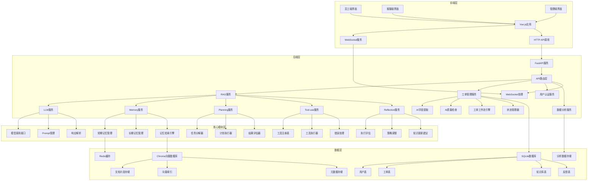

# IT智能客服系统（企业版）技术需求文档

## 一、系统概述与背景

### 1.1 业务价值
- **提升客服处理效率**：通过AI Agent自动处理常见IT问题，预计提升客服处理效率30%，减少人工干预时间。
- **降低IT支持成本**：自动化处理重复问题，预计减少25%的人工工单量，降低运营成本。
- **提高员工满意度**：快速响应IT问题，平均响应时间从传统的24小时缩短至3秒内，提升员工使用体验。
- **知识沉淀与复用**：通过知识库自动积累和更新，实现IT知识的持续沉淀和高效复用。

### 1.2 目标用户
- **企业员工**：需要IT支持的普通员工，使用场景包括遇到软件故障、硬件问题、系统配置等IT相关问题时寻求帮助。
- **IT客服人员**：企业内部的IT支持团队，使用场景包括处理复杂IT问题、审核AI处理结果、管理知识库等。
- **IT管理员**：负责系统配置、监控和维护的IT管理人员，使用场景包括系统设置、性能监控、数据管理等。

### 1.3 系统定位
- **区别于传统RPA**：传统RPA依赖规则化流程，只能处理预定义的明确指令，而本系统的AI Agent能够处理模糊指令和异常情况，提供更灵活的解决方案。
- **区别于通用AI助手**：本系统专注于企业IT领域，基于企业内部知识库提供专业、准确的解决方案，避免通用AI的信息不准确问题。
- **区别于传统工单系统**：传统工单系统需要人工分配和处理，本系统通过AI自动分类、提取信息和提供解决方案，大幅提升处理效率。

### 1.4 核心目标
- **任务完成准确率**：≥85%，确保AI提供的解决方案准确有效。
- **响应时间**：平均响应时间<3秒，95%的请求响应时间<5秒。
- **知识库覆盖率**：企业常见IT问题覆盖率≥90%，确保AI能够解决大部分日常问题。
- **用户满意度**：用户满意度评分≥4.5（5分制），反映系统的实用价值。

## 二、系统架构全景

### 2.1 整体架构图

### 2.2 核心模块划分

#### 2.2.1 前端层
- **Vue.js应用**：基于Vue 3 + TypeScript的单页应用，负责用户界面渲染和交互
- **多端适配**：
  - 员工端：简洁高效的问题提交和解决方案查看界面
  - 客服端：功能丰富的工单处理和AI辅助界面
  - 管理端：系统配置、监控和数据分析界面
- **实时通信**：通过WebSocket实现实时消息推送和状态更新
- **响应式设计**：适配不同设备屏幕尺寸，提供良好的移动端体验

#### 2.2.2 后端层
- **FastAPI服务**：基于Python的高性能Web框架，提供RESTful API和WebSocket服务
- **API路由层**：统一的请求路由和参数验证，处理前端请求分发
- **RAG服务**：检索增强生成服务，整合LLM和知识库，提供智能问答能力
- **工单管理服务**：处理工单的创建、分配、处理和关闭全生命周期
- **用户认证服务**：基于JWT的身份认证和授权管理
- **数据分析服务**：收集和分析系统运行数据，生成报表和洞察
- **WebSocket处理**：处理实时通信，支持消息推送和状态更新

#### 2.2.3 核心模块层

##### 2.2.3.1 LLM服务
- **模型调用接口**：封装DeepSeek API调用，处理请求构建和响应解析
- **Prompt管理**：统一的Prompt模板管理，支持动态Prompt生成和优化
- **响应解析**：解析LLM响应，提取关键信息和结构化数据
- **参数优化**：基于不同任务类型动态调整模型参数

##### 2.2.3.2 Memory服务
- **短期记忆管理**：基于Redis的对话上下文管理，支持会话隔离和上下文压缩
- **长期记忆管理**：基于Chroma的知识库管理，支持文档分段和向量化
- **记忆检索引擎**：混合检索（向量检索+关键词匹配），支持多维度过滤和相关性排序

##### 2.2.3.3 Planning服务
- **任务分解器**：基于ReAct模式和思维链技术，将复杂问题分解为可执行子任务
- **计划执行器**：按照制定的计划逐步执行子任务，处理依赖关系
- **结果评估器**：评估任务执行结果，判断是否需要调整计划

##### 2.2.3.4 Tool-use服务
- **工具注册表**：管理所有可用工具的注册和元数据
- **工具执行器**：执行工具调用，处理参数传递和结果返回
- **错误处理**：处理工具调用失败的情况，提供重试和降级机制

##### 2.2.3.5 Reflection服务
- **执行评估**：评估任务执行效果，收集性能指标和用户反馈
- **策略调整**：基于评估结果调整系统策略和参数
- **知识更新建议**：识别知识库缺口，生成知识更新建议

##### 2.2.3.6 工单相关模块
- **AI字段提取**：从工单描述中自动提取关键字段，如设备类型、问题类型等
- **AI质量检查**：评估工单处理质量，生成质检报告和改进建议
- **工单工作流引擎**：处理工单的状态流转和业务逻辑
- **状态管理器**：管理工单状态的变更和通知

#### 2.2.4 数据层
- **Chroma向量数据库**：存储和索引知识库文档的向量表示
  - **文档片段存储**：存储分割后的文档片段
  - **向量索引**：存储文档片段的向量表示，支持相似性搜索
  - **元数据存储**：存储文档的元数据，支持基于元数据的过滤
- **SQLite数据库**：存储业务数据和系统配置
  - **用户表**：存储用户信息和权限
  - **工单表**：存储工单信息和处理历史
  - **知识库表**：存储知识库文档的元数据
  - **反馈表**：存储用户反馈和评价
- **Redis缓存**：存储短期会话数据和热点信息
- **分析数据存储**：存储系统运行数据和分析结果

### 2.3 系统边界
- **能做什么**：
  - 基于知识库回答企业IT相关问题，支持自然语言交互
  - 自动提取工单信息并分类，支持智能工单分配
  - 提供详细的问题解决方案，包括步骤指导和注意事项
  - 协助客服人员处理复杂问题，提供AI辅助建议
  - 自动更新和管理知识库，支持文档的添加、更新和删除
  - 分析系统运行数据，生成性能报表和业务洞察
  - 支持多端访问，提供实时消息推送和状态更新

- **不能做什么**：
  - 不能自动执行金融交易，涉及资金操作需人工确认
  - 不能访问企业外部未授权资源，严格遵守网络安全规定
  - 不能处理涉及敏感信息的问题（如员工个人隐私数据、企业机密信息）
  - 不能替代人工处理复杂的硬件故障和安全事件，需专业人员介入
  - 不能违反法律法规和企业政策，所有操作需符合合规要求

### 2.4 数据流设计
- **用户请求流程**：
  1. 用户在前端界面输入问题
  2. 前端将请求发送到后端API
  3. 后端路由将请求分发到相应的服务
  4. 服务处理请求，可能调用多个核心模块
  5. 核心模块执行相应的业务逻辑，可能访问数据库或外部服务
  6. 服务将处理结果返回给前端
  7. 前端展示结果给用户

- **知识库更新流程**：
  1. 管理员添加或更新知识库文档
  2. 后端接收文档并进行预处理
  3. Memory服务将文档分割为片段并向量化
  4. 向量化的文档片段存储到Chroma向量数据库
  5. 文档元数据存储到SQLite数据库
  6. 系统更新检索索引，确保新文档可被检索

- **工单处理流程**：
  1. 用户提交工单或系统自动创建工单
  2. 工单管理服务接收工单并进行初步处理
  3. AI字段提取模块提取关键字段
  4. 工单工作流引擎根据规则分配工单
  5. 客服处理工单，可能使用AI辅助建议
  6. 工单处理完成后，AI质量检查模块评估处理质量
  7. 工单状态更新，通知相关用户

### 2.5 系统扩展性设计
- **模块化设计**：采用微服务架构思想，各模块独立部署和扩展
- **服务注册与发现**：支持服务的动态注册和发现，便于水平扩展
- **负载均衡**：支持多实例部署和负载均衡，提高系统可用性
- **缓存策略**：使用Redis缓存热点数据，减少数据库访问压力
- **异步处理**：采用异步IO和消息队列，提高系统并发处理能力
- **弹性伸缩**：根据系统负载自动调整资源，优化资源利用率

### 2.6 系统安全架构
- **网络安全**：
  - 使用TLS 1.3加密传输数据
  - 实施网络访问控制，限制外部访问
  - 定期进行安全漏洞扫描和渗透测试

- **应用安全**：
  - 基于角色的访问控制（RBAC）
  - 输入验证和参数校验，防止注入攻击
  - 密码加密存储，使用bcrypt等安全算法
  - 防止跨站脚本攻击（XSS）和跨站请求伪造（CSRF）

- **数据安全**：
  - 敏感数据加密存储
  - 数据访问审计，记录所有数据操作
  - 数据脱敏处理，保护用户隐私
  - 定期数据备份和灾难恢复演练

- **AI安全**：
  - 模型输出内容审核，防止生成有害内容
  - 限制模型访问敏感信息
  - 监控模型行为，检测异常输出
  - 建立模型使用伦理准则
  - 定期评估模型性能和安全性
  - 实施模型访问控制，防止滥用

## 三、核心模块技术需求

### 3.1 LLM（语言模型）需求

#### 3.1.1 模型选择标准
- **模型版本**：基于DeepSeek API的deepseek-chat模型（版本v1.5）
- **选型依据**：
  - **多语言处理能力**：支持中文、英文等多语言处理，满足企业国际化需求
  - **技术领域理解**：在IT技术领域具有较强的理解能力，能够准确处理技术术语和概念
  - **API稳定性**：提供稳定的RESTful API接口，支持流式响应和批量请求
  - **响应速度**：平均响应时间<2秒，满足实时交互需求
  - **上下文窗口**：支持16K Token的上下文窗口，能够处理长对话和复杂问题
  - **价格性能比**：相比其他商业模型，具有更优的价格性能比

#### 3.1.2 性能指标
- **响应时间**：
  - 平均响应时间<3秒
  - 95%的请求响应时间<5秒
  - 99%的请求响应时间<8秒
- **准确率**：
  - 基于知识库的回答准确率≥85%
  - 关键IT问题准确率≥90%
  - 常见问题准确率≥95%
- **并发能力**：
  - 支持每秒100次以上的API调用
  - 峰值并发支持200次/秒
- **Token处理能力**：
  - 单次请求支持最多4000个Token的上下文
  - 最大输出Token数：2000
  - 每日Token使用限额：100万

#### 3.1.3 更新机制
- **模型版本迭代**：
  - 每季度评估模型性能，根据业务需求决定是否更新模型版本
  - 建立模型评估体系，包括准确率、响应时间、用户满意度等指标
  - 新模型上线前进行灰度测试，确保稳定性
- **回滚策略**：
  - 建立模型版本管理机制，支持多版本并存
  - 当新版本表现不佳时，可快速回滚到稳定版本
  - 设置回滚触发条件，如准确率下降超过5%
- **Prompt优化**：
  - 持续优化Prompt模板，提升模型输出质量
  - 建立Prompt测试和评估体系
  - 根据不同场景设计专用Prompt模板
- **参数调优**：
  - 基于不同任务类型动态调整模型参数
  - 温度参数（temperature）：0.3-0.7，根据任务类型调整
  - 顶P参数（top_p）：0.9-0.95，控制输出多样性

#### 3.1.4 模型调用架构
- **调用方式**：
  - 同步调用：适用于实时交互场景
  - 异步调用：适用于批量处理和后台任务
  - 流式调用：适用于需要实时反馈的场景
- **错误处理**：
  - 网络错误：自动重试机制，最多3次
  - 超时处理：设置30秒超时，超时后降级处理
  - 速率限制：监控API调用频率，避免超出限制
- **缓存策略**：
  - 缓存常见问题的回答，减少重复调用
  - 使用Redis缓存热点数据，过期时间5-10分钟
- **监控与告警**：
  - 实时监控模型调用成功率和响应时间
  - 设置告警阈值，当指标异常时及时通知
  - 定期生成模型调用报告，分析性能趋势

### 3.2 Memory（记忆系统）需求

#### 3.2.1 短期记忆
- **对话上下文管理**：
  - 基于Redis实现对话上下文存储，支持会话隔离
  - 当对话超过5000token时自动摘要，保留关键信息
  - 为每个用户会话维护独立的上下文，确保对话连贯性
- **上下文压缩**：
  - 使用LLM生成对话摘要，压缩长对话历史
  - 采用分层摘要策略，保留不同层级的关键信息
  - 上下文窗口管理，确保重要信息不被丢失
- **会话管理**：
  - 会话超时机制：空闲30分钟后自动清理会话
  - 会话状态同步：确保多端会话状态一致
  - 会话恢复：支持会话中断后恢复

#### 3.2.2 长期记忆
- **向量数据库选型**：
  - 使用ChromaDB v0.5.0+实现，支持元数据过滤和高效检索
  - 选择理由：轻量级部署、易于集成、支持增量更新、性能优异
  - 替代方案评估：对比Pinecone、Weaviate等，ChromaDB更适合本地部署场景
- **存储策略**：
  - **文档分段存储**：
    - 使用RecursiveCharacterTextSplitter，chunk_size=1000，chunk_overlap=100
    - 针对不同类型文档采用不同的分割策略
    - 确保分割后的片段语义完整
  - **元数据索引**：
    - 为每个文档片段添加丰富的元数据：文档ID、标题、分类、标签、创建时间、更新时间等
    - 支持基于元数据的快速过滤和检索
  - **定期优化**：
    - 每周执行一次向量数据库优化，包括索引重建和碎片整理
    - 监控数据库大小和性能，及时进行容量规划

#### 3.2.3 记忆检索
- **检索策略**：
  - **混合检索**：向量检索（40%权重）+关键词匹配（60%权重）
  - **向量检索**：使用余弦相似度计算，找出最相似的文档片段
  - **关键词匹配**：使用TF-IDF算法，计算关键词匹配度
- **检索准确率**：
  - 关键信息检索准确率≥90%
  - 常见问题检索准确率≥95%
  - 复杂问题检索准确率≥85%
- **优化策略**：
  - **动态参数调整**：
    - 根据查询类型自动调整top_k值（默认3-5）
    - 根据问题复杂度调整检索策略
  - **相关性评分**：
    - 基于综合分数（向量相似度+关键词匹配度）排序检索结果
    - 设置相关性阈值，过滤低相关性结果
  - **多维度过滤**：
    - 支持按分类、标签、时间等维度过滤检索结果
    - 实现基于用户角色的个性化检索

#### 3.2.4 记忆更新
- **数据清洗**：
  - 自动去除重复内容和无效信息
  - 处理特殊字符和格式问题
  - 标准化术语和格式
- **分段策略**：
  - 使用RecursiveCharacterTextSplitter，支持自定义分隔符
  - 针对不同类型文档（技术文档、操作手册等）采用不同的分割策略
  - 确保分割后的片段大小适中，便于检索和理解
- **打标规范**：
  - 为每个文档添加标准化的元数据标签
  - 标签体系：文档类型、适用场景、技术领域、难度等级等
  - 支持自动标签生成和人工审核
- **更新机制**：
  - **实时更新**：新文档添加后立即索引
  - **批量更新**：支持批量文档的高效更新
  - **增量更新**：只更新变化的部分，减少计算开销

#### 3.2.5 记忆评估
- **检索性能评估**：
  - 定期测试检索准确率和召回率
  - 分析检索失败案例，优化检索策略
  - 监控检索响应时间，确保性能达标
- **记忆质量评估**：
  - 评估知识库覆盖率和时效性
  - 识别知识缺口和过时信息
  - 基于用户反馈优化记忆系统

#### 3.2.6 存储优化
- **存储容量管理**：
  - 监控数据库大小，设置容量预警
  - 实现数据分层存储，热数据优先
  - 定期清理过时和低价值数据
- **性能优化**：
  - 使用SSD存储提升检索性能
  - 实现缓存机制，加速热点数据访问
  - 优化索引结构，提升检索速度

### 3.3 Planning（任务规划）需求

#### 3.3.1 任务分解方法
- **技术选型**：
  - 采用ReAct模式（Reasoning + Acting），结合思维链(CoT)和思维树(TOT)技术
  - 使用LLM生成任务分解计划，确保分解的合理性和完整性
  - 实现基于规则和机器学习的混合任务分解策略
- **分解策略**：
  - **层次化分解**：将复杂问题分解为多个层级的子任务
  - **子任务定义**：每个子任务明确目标、输入、输出和执行步骤
  - **依赖关系管理**：识别子任务之间的依赖关系，确保执行顺序正确
  - **解决方案选择**：基于知识库和历史经验选择最优解决方案

#### 3.3.2 规划执行流程
1. **任务分析**：
   - 分析用户问题，识别核心需求和关键信息
   - 确定问题类型和复杂度，选择合适的分解策略
   - 评估解决问题所需的资源和时间
2. **子任务分解**：
   - 使用LLM生成初步分解计划
   - 应用分解规则和启发式算法优化计划
   - 验证分解计划的可行性和完整性
3. **资源分配**：
   - 为每个子任务分配必要的资源（知识库检索、工具调用等）
   - 优化资源使用，避免重复和浪费
   - 考虑资源限制，制定合理的执行计划
4. **执行监控**：
   - 实时跟踪子任务执行状态和进度
   - 检测执行过程中的异常和错误
   - 根据执行情况动态调整计划
5. **结果整合**：
   - 收集和处理子任务执行结果
   - 解决结果之间的冲突和不一致
   - 将子任务结果整合成最终解决方案
6. **评估反馈**：
   - 评估解决方案的有效性和完整性
   - 收集用户反馈和执行数据
   - 分析执行过程中的问题和改进机会

#### 3.3.3 失败处理机制
- **回退策略**：
  - 当AI无法解决问题时，自动转为人工处理
  - 为人工处理提供完整的执行历史和上下文信息
  - 建立人工干预的触发条件和流程
- **重试机制**：
  - 对于临时失败的任务，设置最多3次重试机会
  - 每次重试采用不同的执行策略
  - 实现指数退避算法，避免频繁重试导致系统过载
- **错误分类**：
  - 将失败原因分类为：知识不足、系统错误、输入模糊、资源不足等
  - 针对不同类型的错误采用不同的处理策略
  - 建立错误码体系，便于错误追踪和分析
- **学习机制**：
  - 记录失败案例，用于优化模型和知识库
  - 分析失败原因，识别系统弱点
  - 基于失败案例自动更新执行策略和规则

#### 3.3.4 规划评估标准
- **任务分解完整性**：≥85%，确保所有关键子任务都被识别
- **执行效率**：
  - 子任务执行时间<2秒/个
  - 整体规划执行时间<10秒
  - 资源利用率>80%
- **解决方案质量**：
  - 用户满意度评分≥4.5
  - 解决方案正确率≥85%
  - 解决方案完整性≥90%
- **适应性**：
  - 能够处理60%以上的边缘情况
  - 对输入变化的适应能力≥75%
  - 能够从失败中学习和改进

#### 3.3.5 规划优化策略
- **基于历史数据的优化**：
  - 分析历史执行数据，识别最优执行路径
  - 基于历史成功率调整任务分解策略
  - 建立执行模式库，快速匹配相似任务
- **实时优化**：
  - 基于执行过程中的反馈动态调整计划
  - 实现计划的在线学习和改进
  - 利用并行执行提高效率
- **多目标优化**：
  - 平衡执行时间、资源使用和解决方案质量
  - 针对不同类型的任务采用不同的优化目标
  - 实现自适应的优化策略选择

### 3.4 Tool-use（工具调用）需求

#### 3.4.1 工具列表与规范
| 工具名称 | 功能描述 | 输入格式 | 输出格式 | 调用条件 | 权限要求 |
|---------|---------|---------|---------|--------|--------|
| **知识库检索** | 从知识库中检索相关信息 | `{"query": "用户问题", "top_k": 3, "category": "分类", "filters": {"tags": ["网络", "硬件"]}}` | `[{"id": "文档ID", "content": "内容", "score": "相关性分数", "metadata": {"title": "标题", "category": "分类"}}]` | 回答用户问题时 | 所有用户 |
| **工单创建** | 创建新的IT支持工单 | `{"title": "工单标题", "description": "问题描述", "priority": "优先级", "fields": [{"name": "字段名称", "value": "字段值"}]}` | `{"ticket_id": "工单ID", "status": "状态", "assigned_to": "分配人员"}` | AI无法解决问题时 | 所有用户 |
| **字段提取** | 从用户输入中提取关键字段 | `{"query": "用户问题", "retrieved_docs": ["检索结果"]}` | `[{"name": "字段名称", "value": "字段值", "confidence": "置信度"}]` | 创建工单时 | 所有用户 |
| **质量检查** | 检查工单处理质量 | `{"ticket_id": "工单ID", "content": "处理内容", "response": "客服回复"}` | `{"quality_score": "质量分数", "suggestions": ["改进建议"], "evaluation_details": {"accuracy": 0.9, "completeness": 0.8}}` | 工单处理完成后 | 客服人员 |
| **工单状态更新** | 更新工单状态 | `{"ticket_id": "工单ID", "status": "新状态", "comment": "状态变更说明"}` | `{"success": true, "ticket_id": "工单ID", "new_status": "新状态"}` | 工单处理过程中 | 客服人员 |
| **知识库管理** | 管理知识库文档 | `{"action": "add/update/delete", "document": {"id": "文档ID", "title": "标题", "content": "内容", "category": "分类"}}` | `{"success": true, "document_id": "文档ID", "action": "执行操作"}` | 管理知识库时 | 管理员 |
| **数据分析** | 分析系统运行数据 | `{"type": "工单/用户/知识库", "filters": {"start_date": "开始日期", "end_date": "结束日期"}}` | `{"data": [{"metric": "指标名称", "value": "指标值"}], "summary": "分析摘要"}` | 分析系统运行情况时 | 管理员 |

#### 3.4.2 工具调用API
- **API规范**：
  - 使用标准化的函数调用格式，类似于OpenAI Function Calling
  - 支持RESTful API和WebSocket两种调用方式
  - 实现统一的错误处理和响应格式
- **参数验证**：
  - 严格验证工具调用参数的类型、范围和格式
  - 使用Pydantic进行数据模型验证
  - 实现参数依赖检查，确保必需参数存在
- **错误处理**：
  - 提供详细的错误信息和错误码
  - 实现错误层次结构，便于错误分类和处理
  - 支持错误追踪，便于问题定位和调试
- **版本控制**：
  - 支持API版本管理，确保向后兼容
  - 实现版本路由，不同版本API并行运行
  - 提供API变更日志，便于开发者了解变更内容

#### 3.4.3 错误处理
- **失败重试**：
  - 临时网络错误自动重试，最多3次
  - 实现指数退避算法，避免频繁重试导致系统过载
  - 为不同类型的错误设置不同的重试策略
- **错误分类**：
  - **网络错误**：API调用失败、超时等
  - **参数错误**：输入参数不符合要求、格式错误等
  - **权限错误**：无权限执行操作、权限不足等
  - **业务错误**：业务逻辑处理失败、资源不足等
  - **系统错误**：内部系统故障、服务不可用等
- **处理方案**：
  - **网络错误**：自动重试，达到最大重试次数后降级处理
  - **参数错误**：返回详细的错误信息，指导用户修正参数
  - **权限错误**：返回权限不足错误，引导用户获取正确权限
  - **业务错误**：返回业务错误信息，提供解决建议
  - **系统错误**：返回系统错误信息，记录错误日志，通知运维人员

#### 3.4.4 安全控制
- **权限管理**：
  - 基于角色的访问控制（RBAC），限制工具调用权限
  - 实现细粒度的权限控制，可控制到具体工具的具体操作
  - 支持权限继承和权限覆盖，灵活管理权限
- **安全审计**：
  - 记录所有工具调用的详细日志，包括调用者、时间、参数、结果等
  - 实现日志加密存储，确保审计数据安全
  - 支持日志查询和分析，便于安全审计和问题追踪
- **输入验证**：
  - 严格验证工具输入，防止注入攻击和恶意操作
  - 实现输入数据过滤和净化，移除潜在的恶意代码
  - 对敏感信息进行脱敏处理，保护用户隐私
- **调用限制**：
  - 实现API调用频率限制，防止滥用
  - 对资源密集型操作设置配额限制
  - 监控异常调用模式，及时发现和阻止恶意行为

#### 3.4.5 工具注册与发现
- **工具注册**：
  - 实现工具注册机制，支持动态添加和更新工具
  - 为每个工具提供详细的元数据，包括名称、描述、参数、返回值等
  - 支持工具版本管理，确保工具调用的兼容性
- **工具发现**：
  - 实现工具发现机制，允许系统自动发现可用工具
  - 提供工具目录API，便于前端和其他系统了解可用工具
  - 支持工具搜索和过滤，快速找到需要的工具
- **工具绑定**：
  - 实现工具与Agent的绑定机制，确保Agent只能调用授权的工具
  - 支持基于上下文的工具推荐，提高工具使用效率
  - 实现工具调用历史记录，便于分析工具使用情况

#### 3.4.6 性能优化
- **工具调用缓存**：
  - 实现工具调用结果缓存，避免重复调用
  - 设置合理的缓存过期策略，确保数据新鲜度
  - 支持缓存失效机制，确保数据一致性
- **并行调用**：
  - 实现工具并行调用，提高处理效率
  - 支持调用结果的聚合和处理
  - 实现并行调用的错误处理和回退机制
- **异步处理**：
  - 对耗时较长的工具操作实现异步处理
  - 提供任务状态查询和结果获取API
  - 支持异步任务的取消和重试

#### 3.4.7 监控与告警
- **工具调用监控**：
  - 实时监控工具调用成功率、响应时间等指标
  - 实现工具调用异常检测和告警
  - 提供工具调用统计和分析报表
- **性能监控**：
  - 监控工具执行性能，识别性能瓶颈
  - 实现性能基准测试，确保工具性能达标
  - 支持性能优化建议生成
- **可用性监控**：
  - 监控工具可用性，及时发现和处理工具故障
  - 实现工具健康检查，确保工具正常运行
  - 支持工具自动恢复和故障转移

### 3.5 Reflection（自我反思）需求

#### 3.5.1 反思机制设计
- **技术实现**：
  - 基于LLM的自我评估能力，结合用户反馈和执行结果进行反思
  - 实现多维度评估体系，包括执行质量、用户满意度、系统性能等
  - 使用结构化的反思模板，确保反思过程的一致性和完整性
- **评估标准**：
  - **任务完成率**：实际完成的任务占总任务的比例，目标≥90%
  - **解决方案质量**：用户满意度评分，目标≥4.5
  - **响应时间**：从请求到完成的时间，目标<5秒
  - **资源使用**：API调用次数、Token使用量等，目标优化20%
  - **准确率**：解决方案准确率，目标≥85%
  - **用户留存**：用户重复使用系统的比例，目标≥70%
- **评估方法**：
  - **自动评估**：基于预设规则自动计算评估指标，实时更新
  - **人工评估**：每周抽样10%的任务进行人工评估，确保系统性能
  - **用户反馈**：收集用户对解决方案的详细反馈，包括准确性、完整性、有用性等
  - **对比评估**：与历史性能和行业基准进行对比分析

#### 3.5.2 策略调整规则
- **基于反馈的调整**：
  - 根据用户反馈和评估结果自动调整系统策略
  - 建立反馈优先级机制，优先处理高影响的反馈
  - 实现反馈闭环管理，确保每个反馈都得到处理
- **参数优化**：
  - **LLM参数调整**：根据任务类型动态调整温度参数（0.3-0.7）、top_p值（0.9-0.95）等
  - **检索参数优化**：根据查询类型自动调整top_k值（3-10）、相关性阈值等
  - **工具调用参数**：优化工具调用频率和顺序，减少不必要的调用
- **流程优化**：
  - 根据任务类型和历史执行情况优化执行流程
  - 实现流程自动化，减少人工干预环节
  - 建立流程版本管理，支持快速回滚和切换
- **知识更新**：
  - 基于反思结果识别知识库缺口，自动建议知识更新
  - 实现知识优先级排序，优先更新高价值知识
  - 建立知识验证机制，确保更新知识的准确性

#### 3.5.3 反思频率与深度
- **实时反思**：
  - 每次任务执行后立即进行简单反思，评估任务执行情况
  - 生成任务级反思报告，包括执行结果、改进建议等
  - 实时调整当前会话的策略和参数
- **定期反思**：
  - 每天执行一次全面反思，分析系统当日性能
  - 生成日报，包括关键指标、趋势分析、问题识别等
  - 调整次日的系统策略和参数
- **深度反思**：
  - 每周执行一次深度反思，制定优化策略
  - 生成周报，包括周性能分析、趋势预测、优化计划等
  - 制定下周的详细优化方案
- **月度反思**：
  - 每月执行一次全面评估，分析系统整体性能
  - 生成月报，包括月度性能总结、长期趋势分析、战略调整建议等
  - 制定下月的系统迭代计划

#### 3.5.4 反思结果应用
- **模型优化**：
  - 基于反思结果调整Prompt模板和模型参数
  - 建立Prompt版本管理和A/B测试机制
  - 分析模型输出模式，识别需要改进的领域
- **知识库更新**：
  - 识别知识缺口，自动生成知识库更新建议
  - 支持批量知识更新和验证
  - 建立知识质量评估机制，确保更新知识的准确性
- **流程改进**：
  - 优化任务执行流程，提升效率和质量
  - 识别流程瓶颈，提出流程重组建议
  - 实现流程自动化，减少人工干预
- **系统迭代**：
  - 基于反思结果制定系统迭代计划
  - 优先级排序：影响范围、改进效果、实现难度
  - 建立迭代评估机制，确保迭代效果
- **报告生成**：
  - 生成定期性能报告，为管理层提供决策依据
  - 支持自定义报告模板和参数
  - 实现报告自动分发和存档

#### 3.5.5 学习与改进机制
- **增量学习**：
  - 基于新数据和反馈不断改进系统
  - 实现在线学习，实时更新模型和策略
  - 建立学习效果评估体系，确保学习效果
- **跨场景学习**：
  - 实现跨场景知识迁移和应用
  - 识别不同场景的共性和差异，优化系统适应能力
  - 建立场景知识库，提升特定场景的处理能力
- **错误学习**：
  - 记录和分析错误案例，避免重复错误
  - 建立错误模式库，快速识别和处理常见错误
  - 实现错误自动分类和处理建议生成
- **最佳实践提取**：
  - 从成功案例中提取最佳实践
  - 建立最佳实践库，指导系统执行
  - 实现最佳实践自动应用，提升系统性能

#### 3.5.6 反思数据管理
- **数据存储**：
  - 存储反思过程和结果的详细数据，包括评估指标、改进建议、执行记录等
  - 建立反思数据索引，支持快速查询和分析
  - 实现数据分层存储，确保数据安全和可访问性
- **数据分析**：
  - 定期分析反思数据，识别系统改进趋势
  - 建立反思数据可视化仪表板，实时展示系统状态
  - 支持多维度数据分析，如按时间、任务类型、错误类型等
- **数据隐私**：
  - 对敏感数据进行脱敏处理，保护用户隐私
  - 实现访问控制，确保只有授权人员可以访问反思数据
  - 遵守数据隐私法规和企业政策

#### 3.5.7 反思效果评估
- **评估指标**：
  - **改进实施率**：反思建议的实际实施比例，目标≥80%
  - **指标改善率**：关键指标的改善程度，目标≥15%
  - **用户满意度提升**：用户满意度的提升幅度，目标≥10%
  - **系统性能提升**：系统响应时间、准确率等指标的提升幅度，目标≥20%
- **评估方法**：
  - **前后对比**：对比反思前后的系统性能指标
  - **A/B测试**：通过A/B测试验证改进效果
  - **长期跟踪**：长期跟踪系统性能趋势，确保改进的可持续性
- **持续优化**：
  - 基于反思效果评估结果，持续优化反思机制
  - 调整反思频率、深度和方法，提升反思效果
  - 建立反思效果评估闭环，确保系统持续改进

## 四、系统接口需求

### 4.1 输入接口
- **用户输入格式**：
  - **文本输入**：支持纯文本输入，最大长度1000字符，支持中文、英文等多语言
  - **结构化输入**：支持JSON格式的结构化数据输入，如工单表单、查询参数等
  - **附件上传**：支持图片（PNG、JPG、JPEG）、文档（PDF、DOCX）等附件上传，单个文件最大10MB
  - **语音输入**：支持语音转文本输入，识别准确率≥90%
- **内容规范**：
  - **自然语言处理**：支持自然语言描述IT问题，理解意图和实体
  - **结构化数据**：支持键值对、表格等结构化数据输入
  - **多模态输入**：支持文本+图片的多模态输入，用于问题诊断
- **预处理要求**：
  - **输入验证**：
    - 检查输入长度和格式是否符合要求
    - 验证必填字段是否存在
    - 检查输入内容是否包含敏感信息
  - **去重处理**：
    - 去除重复输入，避免重复处理
    - 实现输入缓存，缓存时间10分钟
  - **标准化处理**：
    - 统一输入格式和术语
    - 转换不同格式的日期、时间等数据
    - 处理拼写错误和语法问题
  - **安全过滤**：
    - 过滤恶意输入和注入攻击
    - 对敏感信息进行脱敏处理
    - 检查输入内容是否符合企业政策

### 4.2 输出接口
- **输出格式**：
  - **文本输出**：
    - 纯文本：简洁明了的文本回答
    - 结构化文本：使用Markdown格式的结构化文本，支持标题、列表、代码块等
    - 富文本：支持HTML格式的富文本，用于复杂展示
  - **JSON输出**：
    - API调用返回标准化JSON格式，包含状态码、消息、数据等字段
    - 支持嵌套JSON结构，用于复杂数据返回
    - 实现统一的错误响应格式
  - **流式输出**：
    - 支持实时流式响应，用于长文本生成
    - 实现Server-Sent Events (SSE)和WebSocket两种流式输出方式
    - 流式输出速率：每秒至少20个字符
  - **文件输出**：
    - 支持PDF、Excel等格式的文件导出
    - 支持生成报表和分析文档
- **内容规范**：
  - **准确性**：基于知识库内容，不添加未经验证的信息
  - **实用性**：提供可操作的详细步骤，便于用户执行
  - **结构化**：使用清晰的层次结构和格式，便于阅读和理解
  - **一致性**：保持输出风格和格式的一致性
  - **完整性**：确保输出内容完整，不遗漏关键信息
- **展示方式**：
  - **员工端**：
    - 简洁版回答，直接给出核心解决方案和操作步骤
    - 重点突出，使用醒目的格式标注关键信息
    - 支持一键复制解决方案
  - **客服端**：
    - 详细版回答，包含问题诊断、解决方案、注意事项等
    - 提供相关知识库链接和参考资料
    - 支持编辑和自定义回答内容
  - **管理端**：
    - 专业版回答，包含技术细节、系统日志等
    - 提供数据分析和趋势图表
    - 支持批量操作和导出功能

### 4.3 外部系统集成
- **API集成**：
  - **CRM系统集成**：
    - 支持与企业内部CRM系统集成，同步用户信息和客户历史
    - 实现双向数据同步，确保数据一致性
    - 支持客户标签和分类同步
  - **ERP系统集成**：
    - 支持与ERP系统集成，获取设备和资产信息
    - 实现资产状态查询和更新
    - 支持工单与资产关联
  - **监控系统集成**：
    - 支持与监控系统集成，获取系统状态信息和告警
    - 实现告警自动转工单功能
    - 支持监控数据可视化展示
  - **知识库系统集成**：
    - 支持与企业现有知识库系统集成
    - 实现知识自动同步和更新
    - 支持多知识库联合检索
  - **工单系统集成**：
    - 支持与现有工单系统集成
    - 实现工单状态同步和更新
    - 支持工单优先级管理
- **集成规范**：
  - **API设计**：
    - 使用RESTful API进行集成，遵循RESTful设计原则
    - 实现版本控制，支持API版本管理
    - 提供详细的API文档和示例
  - **身份验证**：
    - 采用OAuth2.0进行身份验证，确保API安全
    - 支持API密钥和令牌两种认证方式
    - 实现令牌过期和刷新机制
  - **数据传输**：
    - 使用HTTPS加密传输数据，确保数据安全
    - 支持数据压缩，减少传输数据量
    - 实现请求和响应的完整性校验
  - **事件通知**：
    - 支持Webhook机制接收外部系统事件
    - 实现事件过滤和路由，确保事件正确处理
    - 支持事件重试机制，确保事件不丢失
  - **错误处理**：
    - 实现统一的错误处理机制，返回标准错误码和消息
    - 支持错误日志记录和告警
    - 实现错误分级和处理策略

### 4.4 数据交换格式
- **主要格式**：
  - **JSON格式**：
    - 支持UTF-8编码，确保多语言兼容性
    - 实现标准JSON结构，包含状态码、消息、数据等字段
    - 支持JSON Schema验证，确保数据格式正确
  - **Protocol Buffers**：
    - 支持Protocol Buffers格式，用于高性能数据交换
    - 实现序列化和反序列化机制
    - 支持版本兼容性管理
- **辅助格式**：
  - **XML格式**：
    - 用于部分传统系统集成，确保兼容性
    - 支持XML Schema验证，确保数据格式正确
    - 实现XML与JSON的双向转换
  - **CSV格式**：
    - 用于数据导出和报表生成，便于Excel等工具处理
    - 支持自定义分隔符和编码
    - 实现大文件分块导出，避免内存溢出
  - **YAML格式**：
    - 用于配置文件和结构化数据，便于人类阅读和编辑
    - 支持注释和复杂结构
  - **Markdown格式**：
    - 用于文档和知识库内容，支持富文本格式
    - 实现Markdown与HTML的转换
- **数据压缩**：
  - 支持gzip压缩，减少传输数据量，压缩率≥70%
  - 支持deflate压缩，用于特定场景
  - 实现压缩级别可配置，平衡压缩率和性能
- **数据加密**：
  - 支持敏感数据加密传输，使用AES-256加密算法
  - 实现端到端加密，确保数据安全
  - 支持数字签名，确保数据完整性和真实性

### 4.5 API设计规范
- **API风格**：
  - 采用RESTful API风格，使用HTTP方法表示操作类型
  - 实现资源导向的API设计，使用URL表示资源
  - 支持HATEOAS原则，提供资源导航链接
- **请求设计**：
  - **HTTP方法**：使用GET、POST、PUT、DELETE等HTTP方法
  - **参数传递**：
    - 查询参数：用于过滤、排序、分页等
    - 路径参数：用于标识资源
    - 请求体：用于传递复杂数据
  - **请求头**：
    - 实现标准HTTP请求头，如Content-Type、Authorization等
    - 支持自定义请求头，用于特定场景
- **响应设计**：
  - **状态码**：使用标准HTTP状态码，如200、400、500等
  - **响应结构**：
    - 成功响应：包含状态码、消息、数据等字段
    - 错误响应：包含状态码、错误码、错误消息、详细信息等字段
  - **分页响应**：
    - 实现标准化的分页响应格式，包含总数、页码、每页数量、数据等字段
    - 支持排序和过滤参数
- **版本控制**：
  - 实现API版本控制，使用URL路径或请求头指定版本
  - 支持多版本并行运行，确保向后兼容
  - 提供版本迁移指南和工具
- **文档规范**：
  - 使用OpenAPI 3.0规范编写API文档
  - 提供交互式API文档，如Swagger UI
  - 包含API用法示例和最佳实践

### 4.6 接口性能要求
- **响应时间**：
  - 简单请求：<1秒
  - 复杂请求：<3秒
  - 批量请求：<5秒
- **并发能力**：
  - 支持每秒1000次以上的API调用
  - 峰值并发支持2000次/秒
- **可用性**：
  - API可用性≥99.9%
  - 计划维护时间每月不超过4小时
- **吞吐量**：
  - 支持每天100万次API调用
  - 支持每秒10MB的数据传输量
- **容错能力**：
  - 实现请求重试机制，最多3次
  - 支持降级服务，确保核心功能可用
  - 实现熔断机制，防止级联故障

### 4.7 接口监控与告警
- **监控指标**：
  - **请求量**：每秒请求数、每日请求数等
  - **响应时间**：平均响应时间、95%响应时间、99%响应时间等
  - **错误率**：4xx错误率、5xx错误率等
  - **可用性**：API可用率、服务中断时间等
  - **性能指标**：CPU使用率、内存使用率、网络带宽等
- **监控工具**：
  - 实现基于Prometheus的监控系统
  - 集成Grafana可视化仪表板
  - 支持自定义监控指标和告警规则
- **告警机制**：
  - 实现多级告警，包括警告、严重、紧急等级别
  - 支持多种告警方式，如邮件、短信、Webhook等
  - 实现告警静默和抑制，避免告警风暴
  - 建立告警处理流程，确保告警及时处理
- **日志记录**：
  - 实现详细的API调用日志，包括请求参数、响应结果、处理时间等
  - 支持日志分级，如INFO、WARN、ERROR等
  - 实现日志聚合和分析，便于问题定位和性能优化
  - 支持日志导出和存档，保留期至少30天

## 五、性能与质量需求

### 5.1 响应时间
- **用户交互响应**：
  - 平均响应时间：<3秒
  - 95%分位响应时间：<5秒
  - 99%分位响应时间：<8秒
  - 实时对话响应：<2秒
- **API响应时间**：
  - 简单查询：<1秒
  - 复杂查询：<3秒
  - 批量操作：<5秒
  - 文件上传/下载：<10秒（10MB文件）
- **系统启动时间**：
  - 服务启动时间：<30秒
  - 数据库初始化时间：<10秒
  - 缓存预热时间：<5秒
- **任务执行时间**：
  - 单任务执行：<10秒
  - 批量任务执行：<30秒（100个任务）
  - 知识库更新：<60秒（1000文档）

### 5.2 准确率与质量
- **任务准确率**：
  - 关键任务完成准确率：≥85%
  - 一般任务完成准确率：≥80%
  - 复杂任务完成准确率：≥75%
- **知识库相关**：
  - 知识库检索准确率：≥90%
  - 知识匹配度：≥85%
  - 知识覆盖率：≥80%
- **NLP相关**：
  - 意图识别准确率：≥85%
  - 实体提取准确率：≥80%
  - 字段提取准确率：≥80%
  - 情感分析准确率：≥75%
- **错误率**：
  - 系统错误率：<1%
  - 业务错误率：<4%
  - 总体错误率：<5%
- **质量指标**：
  - 用户满意度评分：≥4.5（满分5分）
  - 解决方案采纳率：≥80%
  - 问题解决率：≥75%
  - 二次咨询率：<20%

### 5.3 可用性与可靠性
- **系统可用性**：
  - 系统可用性目标：99.9%
  - 计划维护时间：每月不超过4小时
  - 非计划停机时间：每年不超过8.76小时
- **故障恢复**：
  - 故障检测时间：<5分钟
  - 故障恢复时间：<30分钟
  - 数据恢复时间：<15分钟
  - 服务恢复时间：<10分钟
- **可靠性**：
  - 系统稳定性：连续运行30天无故障
  - 数据一致性：确保99.99%的数据一致性
  - 服务连续性：支持无缝切换和故障转移
  - 备份恢复：支持全量备份和增量备份

### 5.4 扩展性与容量
- **用户并发**：
  - 支持的并发用户数：最大1000并发用户
  - 峰值并发支持：2000并发用户
  - 每秒请求处理：1000次/秒
- **数据量扩展**：
  - **知识库容量**：
    - 支持10万+文档
    - 每个文档最大10MB
    - 总知识库大小：1TB
  - **工单存储**：
    - 支持100万+历史工单
    - 每个工单最大1MB
    - 总工单数据大小：500GB
  - **对话历史**：
    - 支持每个用户1000+条对话记录
    - 每条对话最大50KB
    - 总对话数据大小：200GB
  - **用户数据**：
    - 支持10万+用户
    - 每个用户最大1MB
    - 总用户数据大小：50GB
- **水平扩展**：
  - 支持通过增加服务器节点实现水平扩展
  - 实现自动负载均衡和流量分发
  - 支持容器化部署，便于弹性伸缩
  - 支持服务注册与发现，实现高可用
- **垂直扩展**：
  - 支持通过增加服务器资源实现垂直扩展
  - 优化系统架构，充分利用硬件资源
  - 支持多实例部署，提高服务容量

### 5.5 资源使用效率
- **CPU使用率**：
  - 平均CPU使用率：<50%
  - 峰值CPU使用率：<80%
  - CPU核心数：支持8核以上
- **内存使用率**：
  - 平均内存使用率：<60%
  - 峰值内存使用率：<85%
  - 内存容量：支持16GB以上
- **存储使用率**：
  - 平均存储使用率：<70%
  - 存储IOPS：支持1000以上
  - 存储吞吐量：支持100MB/s以上
- **网络使用率**：
  - 平均网络使用率：<50%
  - 峰值网络使用率：<80%
  - 网络带宽：支持1Gbps以上
- **API调用效率**：
  - API调用成功率：≥99%
  - API调用频率：支持100次/秒以上
  - Token使用效率：优化20%以上

### 5.6 安全性与合规性
- **安全指标**：
  - 安全漏洞数量：<5个/季度
  - 安全事件响应时间：<24小时
  - 安全扫描覆盖率：100%
- **合规性**：
  - 符合ISO 27001信息安全管理标准
  - 符合GDPR数据保护要求
  - 符合企业内部安全政策
- **数据安全**：
  - 数据加密率：100%
  - 数据备份频率：每日全量备份，每小时增量备份
  - 数据保留期：符合法规要求

### 5.7 监控与告警
- **监控指标**：
  - **性能监控**：响应时间、吞吐量、并发数等
  - **系统监控**：CPU、内存、存储、网络等
  - **业务监控**：任务完成率、准确率、用户满意度等
  - **安全监控**：访问日志、异常行为、安全事件等
- **告警机制**：
  - **告警级别**：信息、警告、严重、紧急
  - **告警方式**：邮件、短信、Webhook、监控平台
  - **告警阈值**：基于历史数据和业务需求动态调整
  - **告警处理**：建立告警处理流程，确保及时响应
- **监控工具**：
  - 实现基于Prometheus的监控系统
  - 集成Grafana可视化仪表板
  - 支持自定义监控指标和告警规则
  - 实现分布式追踪，便于问题定位

### 5.8 测试与评估
- **性能测试**：
  - **负载测试**：模拟1000并发用户的系统性能
  - **压力测试**：测试系统极限性能和稳定性
  - ** endurance测试**：测试系统长时间运行的稳定性
  - ** spike测试**：测试系统对突发流量的处理能力
- **质量测试**：
  - **功能测试**：验证系统功能的正确性和完整性
  - **回归测试**：确保系统变更不会引入新问题
  - **用户验收测试**：验证系统是否满足用户需求
  - **安全测试**：测试系统的安全性和防护能力
- **评估方法**：
  - **自动化评估**：使用自动化工具定期评估系统性能
  - **人工评估**：定期抽样人工评估系统质量
  - **用户反馈**：收集用户对系统性能和质量的反馈
  - **对比评估**：与历史性能和行业基准进行对比分析

### 5.9 优化策略
- **性能优化**：
  - **缓存优化**：实现多级缓存，减少数据库访问
  - **索引优化**：优化数据库索引，提升查询性能
  - **代码优化**：优化关键代码路径，提升执行效率
  - **并发优化**：实现异步处理和并行执行，提升并发能力
- **资源优化**：
  - **资源调度**：优化资源分配和调度，提高资源利用率
  - **连接池**：实现数据库连接池，减少连接开销
  - **线程池**：优化线程池配置，提高并发处理能力
  - **内存管理**：优化内存使用，减少内存泄漏
- **扩展性优化**：
  - **模块化设计**：实现模块化架构，便于扩展和维护
  - **服务化**：将系统拆分为微服务，提高扩展性和可靠性
  - **容器化**：使用Docker容器化部署，便于弹性伸缩
  - **自动化部署**：实现CI/CD流程，提高部署效率

### 5.10 容灾与备份
- **容灾策略**：
  - **多活架构**：实现多数据中心部署，提高系统可用性
  - **灾备切换**：建立灾备切换机制，确保业务连续性
  - **故障隔离**：实现服务隔离，防止级联故障
  - **冗余设计**：关键组件冗余部署，提高系统可靠性
- **备份策略**：
  - **数据备份**：每日全量备份，每小时增量备份
  - **配置备份**：定期备份系统配置，确保可恢复性
  - **代码备份**：使用版本控制系统管理代码，确保代码安全
  - **备份验证**：定期验证备份的有效性和完整性
- **恢复策略**：
  - **快速恢复**：建立快速恢复机制，减少业务中断时间
  - **分阶段恢复**：实现分阶段恢复策略，优先恢复核心功能
  - **恢复测试**：定期进行恢复测试，确保恢复流程的有效性
  - **恢复演练**：每年至少进行一次完整的灾备演练

## 六、安全与合规需求

### 6.1 数据安全
- **数据加密**：
  - **传输加密**：
    - 使用TLS 1.3加密传输数据，确保数据在传输过程中的安全
    - 实现强制HTTPS，禁止HTTP访问
    - 定期更新SSL/TLS证书，确保证书有效性
  - **存储加密**：
    - 敏感数据使用AES-256加密存储，确保数据在存储状态的安全
    - 实现数据库透明加密（TDE），保护静态数据
    - 对备份数据进行加密，确保备份数据安全
  - **密钥管理**：
    - 采用安全的密钥管理方案，定期轮换密钥
    - 实现密钥备份和恢复机制，确保密钥安全
    - 限制密钥访问权限，只有授权人员可以访问密钥

- **访问控制**：
  - **基于角色的访问控制（RBAC）**：
    - 实现细粒度的RBAC，可控制到具体操作和数据
    - 定义清晰的角色和权限矩阵，确保权限分配合理
    - 支持权限继承和覆盖，灵活管理权限
  - **最小权限原则**：
    - 用户只能访问必要的资源，减少权限滥用风险
    - 实现权限自动过期机制，定期审查权限
    - 建立权限申请和审批流程，规范权限管理
  - **多因素认证**：
    - 管理员账户必须使用多因素认证
    - 对敏感操作强制要求多因素认证
    - 支持短信验证码、邮件验证码、TOTP等多种MFA方式

- **安全审计**：
  - **日志记录**：
    - 记录所有关键操作的详细日志，包括操作人、时间、操作类型、操作内容等
    - 实现审计日志加密存储，确保审计数据安全
    - 建立审计日志备份机制，防止日志丢失
  - **定期审计**：
    - 定期进行安全审计，评估系统安全状态
    - 每季度进行一次漏洞扫描，发现系统漏洞
    - 每年聘请第三方安全公司进行渗透测试

### 6.2 隐私保护
- **用户数据匿名化**：
  - 处理用户数据时进行匿名化处理，保护用户隐私
  - 实现数据去标识化，确保无法识别特定用户
  - 建立匿名化数据使用规范，确保数据安全使用

- **脱敏处理**：
  - 对敏感信息（如邮箱、电话号码、身份证号）进行脱敏处理
  - 实现动态数据脱敏，根据用户权限显示不同级别的数据
  - 支持多种脱敏算法，适应不同场景需求

- **数据最小化**：
  - 只收集和存储必要的数据，避免过度收集
  - 建立数据收集清单，明确数据收集目的和范围
  - 定期清理不需要的数据，减少数据存储风险

- **用户同意**：
  - 获取用户对数据处理的明确同意
  - 实现同意管理机制，记录用户同意状态
  - 支持用户撤回同意，停止数据处理

- **隐私设计**：
  - 采用隐私设计原则，在系统设计阶段考虑隐私保护
  - 实现隐私影响评估（PIA），识别隐私风险
  - 建立隐私保护措施，降低隐私风险

### 6.3 合规性
- **法规合规**：
  - **符合GDPR要求**：
    - 遵循欧盟通用数据保护条例的规定
    - 实现数据主体权利，包括访问权、被遗忘权、数据可携带权等
    - 建立数据保护影响评估（DPIA）机制
  - **符合网络安全法**：
    - 遵循中国网络安全法的要求
    - 实现网络安全等级保护，确保系统安全
    - 建立网络安全事件报告机制
  - **符合行业标准**：
    - 遵循ISO 27001信息安全管理体系标准
    - 建立信息安全管理体系（ISMS）
    - 定期进行ISO 27001认证和更新

- **数据本地化**：
  - 用户数据存储在本地服务器，符合数据本地化要求
  - 实现数据分类存储，根据数据类型选择合适的存储位置
  - 建立数据跨境传输机制，确保符合数据跨境传输要求

- **内部合规**：
  - **符合企业内部安全政策**：
    - 遵循企业内部安全政策和标准
    - 建立内部安全合规检查机制
    - 定期进行内部合规审计
  - **符合数据分类和处理规范**：
    - 实现数据分类管理，根据敏感度分级处理
    - 建立数据处理规范，确保数据处理合规
    - 定期审查数据分类和处理情况

### 6.4 安全审计
- **安全事件记录**：
  - 记录所有安全相关事件，包括登录尝试、权限变更、异常访问等
  - 实现安全事件关联分析，发现复杂攻击
  - 建立安全事件知识库，积累处理经验

- **监控机制**：
  - 实时监控系统安全状态，检测异常行为
  - 实现网络流量监控，检测异常流量
  - 建立系统性能监控，发现性能异常

- **告警机制**：
  - 设置安全告警阈值，当检测到异常时及时告警
  - 实现多级告警机制，根据事件严重程度触发不同级别告警
  - 支持多种告警方式，如邮件、短信、Webhook等

- **应急响应**：
  - 建立安全事件应急响应流程，快速处理安全事件
  - 明确应急响应角色和责任，确保及时响应
  - 定期进行应急响应演练，提高响应能力

### 6.5 AI安全
- **模型安全**：
  - **模型保护**：
    - 保护模型权重和参数，防止模型窃取
    - 实现模型访问控制，限制模型使用权限
    - 对模型输入和输出进行验证，防止模型攻击
  - **模型评估**：
    - 定期评估模型安全性，发现模型漏洞
    - 测试模型对对抗样本的鲁棒性
    - 建立模型安全基准，持续监控模型安全状态

- **数据安全**：
  - **训练数据安全**：
    - 确保训练数据的合法性和安全性
    - 对训练数据进行去标识化处理，保护隐私
    - 建立训练数据访问控制，限制数据使用权限
  - **推理数据安全**：
    - 对推理输入和输出进行加密，确保数据安全
    - 实现推理结果验证，防止模型输出恶意内容
    - 建立推理数据审计，记录模型使用情况

- **伦理合规**：
  - **公平性**：
    - 确保模型输出公平，不歧视特定群体
    - 定期评估模型的公平性，发现和解决偏见问题
  - **透明度**：
    - 提供模型决策过程的解释，确保可解释性
    - 建立模型使用说明，明确模型能力和限制
  - **责任**：
    - 明确AI系统的责任边界，确保责任可追溯
    - 建立AI伦理委员会，监督AI系统的开发和使用

### 6.6 安全意识与培训
- **员工培训**：
  - 对所有员工进行安全意识培训，提高安全意识
  - 定期进行钓鱼邮件模拟演练，测试员工安全意识
  - 建立安全奖励机制，鼓励员工报告安全问题

- **安全宣传**：
  - 定期发布安全公告和最佳实践
  - 建立安全文化，使安全成为企业价值观的一部分
  - 提供安全资源和工具，帮助员工提高安全技能

- **安全认证**：
  - 鼓励IT人员获取安全认证，如CISSP、CISM等
  - 建立安全认证奖励机制，提高员工积极性
  - 定期组织安全培训和研讨会，更新安全知识

## 七、部署与运维需求

### 7.1 部署环境
- **硬件要求**：
  - 服务器：至少8核CPU，16GB内存，500GB存储空间
  - 网络：稳定的网络连接，带宽≥100Mbps
- **云环境要求**：
  - 支持主流云平台（AWS、Azure、阿里云等）
  - 支持容器化部署（Docker、Kubernetes）
- **操作系统**：
  - 后端：Ubuntu 20.04 LTS或Windows Server 2019
  - 前端：无特殊要求
- **依赖库**：
  - 后端：Python 3.9+, FastAPI, ChromaDB, SQLite
  - 前端：Vue.js 3+, TypeScript

### 7.2 监控指标
- **关键性能指标**：
  - API响应时间：平均响应时间<3秒
  - 系统负载：CPU使用率<70%，内存使用率<80%
  - 错误率：API错误率<1%
  - 并发用户数：实时监控并发用户数
- **业务指标**：
  - 工单处理量：每日处理工单数量
  - 解决率：AI成功解决的问题比例
  - 用户满意度：用户反馈评分
- **监控工具**：
  - 系统监控：Prometheus + Grafana
  - 日志监控：ELK Stack
  - 业务监控：自定义监控面板

### 7.3 日志记录
- **日志格式**：JSON格式，包含时间戳、级别、模块、消息等字段
- **存储周期**：
  - 系统日志：保存30天
  - 业务日志：保存90天
  - 安全日志：保存180天
- **分析要求**：
  - 日志聚合：集中存储和管理所有日志
  - 日志分析：定期分析日志，识别异常和优化机会
  - 可视化：提供日志分析可视化界面

### 7.4 自动化运维
- **部署自动化**：使用CI/CD工具实现自动化部署
- **扩缩容自动化**：基于负载自动调整服务器资源
- **故障恢复自动化**：实现故障自动检测和恢复
- **备份自动化**：定期自动备份数据和配置

## 八、测试与验收标准

### 8.1 测试用例
| 测试场景 | 测试步骤 | 预期结果 |
|---------|---------|---------|
| 智能问答 | 1. 输入常见IT问题 2. 验证回答准确性 3. 测量响应时间 | 1. 回答准确且基于知识库 2. 响应时间<3秒 3. 格式符合要求 |
| 工单创建 | 1. 输入问题描述 2. 验证字段提取 3. 检查工单状态 | 1. 正确提取关键字段 2. 工单成功创建 3. 状态更新正确 |
| 知识库管理 | 1. 添加新文档 2. 更新现有文档 3. 检索测试 | 1. 文档成功添加 2. 更新生效 3. 检索结果相关 |
| 性能测试 | 1. 模拟100并发用户 2. 测量系统响应时间 3. 检查系统稳定性 | 1. 平均响应时间<3秒 2. 系统无崩溃 3. 资源使用正常 |
| 安全测试 | 1. 尝试未授权访问 2. 输入恶意代码 3. 检查安全日志 | 1. 访问被拒绝 2. 输入被过滤 3. 安全事件被记录 |

### 8.2 验收指标
- **功能验收**：所有核心功能正常运行，测试用例通过率≥95%
- **性能验收**：
  - 平均响应时间<3秒
  - 95%分位响应时间<5秒
  - 系统可用性≥99.9%
- **准确率验收**：
  - 关键任务完成准确率≥85%
  - 知识库检索准确率≥90%
  - 字段提取准确率≥80%
- **安全验收**：通过安全漏洞扫描，无高危漏洞

### 8.3 测试环境
- **硬件配置**：与生产环境相同或相似的硬件配置
- **软件环境**：与生产环境相同的软件版本和配置
- **网络环境**：模拟生产环境的网络延迟和带宽
- **数据环境**：使用真实数据的子集，确保数据代表性

### 8.4 测试数据
- **测试数据集**：
  - 知识库数据：包含1000+文档，覆盖常见IT问题
  - 用户问题：收集500+真实用户问题
  - 工单数据：模拟1000+工单记录
- **数据生成方法**：
  - 真实数据收集：从现有系统导出真实数据
  -  synthetic数据生成：使用脚本生成测试数据
  - 边界数据：生成边界情况的测试数据

## 九、迭代与演进规划

### 9.1 短期迭代（3-6个月）
| 迭代阶段 | 时间 | 主要功能 |
|---------|------|---------|
| 第一阶段 | 1-2个月 | 核心问答功能、知识库管理、工单基础功能 |
| 第二阶段 | 3-4个月 | 智能字段提取、质量检查、用户反馈系统 |
| 第三阶段 | 5-6个月 | 数据分析报表、系统集成、性能优化 |

### 9.2 长期演进（1-2年）
- **功能增强**：
  - 多语言支持：支持英文、日文等多语言处理
  - 语音交互：添加语音输入和输出功能
  - 视频教程：集成视频教程库，提供更直观的解决方案
  - 预测性维护：基于历史数据预测可能的IT问题
- **技术升级**：
  - 模型升级：使用更先进的LLM模型
  - 架构优化：采用微服务架构，提升系统弹性
  - 智能化程度：增强AI的自主决策能力
- **生态建设**：
  - 开放API：提供开放API，支持第三方集成
  - 插件系统：支持自定义插件，扩展系统功能
  - 社区建设：建立用户社区，促进知识共享

### 9.3 技术债务管理
- **识别机制**：
  - 定期代码审查，识别技术债务
  - 使用静态代码分析工具检测潜在问题
  - 收集开发团队反馈，识别痛点
- **处理计划**：
  - 短期债务：在每个迭代中优先解决
  - 中期债务：在季度迭代中集中解决
  - 长期债务：在重大版本更新中彻底解决
- **预防措施**：
  - 建立代码规范，减少技术债务产生
  - 定期重构，保持代码质量
  - 投资自动化测试，防止回归

### 9.4 技术风险
- **模型风险**：
  - 风险：LLM模型可能产生不准确的回答
  - 应对：建立严格的质量检查机制，对低置信度回答进行人工审核
- **数据风险**：
  - 风险：知识库数据过时或不完整
  - 应对：建立知识库更新机制，定期审核和更新内容
- **安全风险**：
  - 风险：系统可能受到网络攻击
  - 应对：加强安全措施，定期进行安全审计和漏洞扫描
- **集成风险**：
  - 风险：与现有系统集成可能出现兼容性问题
  - 应对：进行充分的集成测试，建立回退机制

## 十、风险与应对

### 10.1 技术风险
- **模型幻觉**：LLM可能生成与事实不符的内容
  - **应对策略**：
    - 严格基于知识库内容生成回答
    - 对低置信度回答添加人工审核流程
    - 定期评估模型输出质量

- **工具调用失败**：外部工具调用可能失败或超时
  - **应对策略**：
    - 实现工具调用超时机制
    - 为关键工具提供备用方案
    - 监控工具调用成功率，及时发现问题

- **性能瓶颈**：系统可能在高负载下性能下降
  - **应对策略**：
    - 实现系统监控和自动扩缩容
    - 优化关键路径代码
    - 使用缓存减少重复计算

- **数据安全**：用户数据可能被泄露或滥用
  - **应对策略**：
    - 实施严格的数据加密和访问控制
    - 定期进行安全审计和渗透测试
    - 建立数据泄露应急响应机制

### 10.2 业务风险
- **用户接受度**：用户可能对AI系统持怀疑态度
  - **应对策略**：
    - 提供人机协作模式，逐步引导用户接受
    - 展示系统的准确性和效率优势
    - 收集用户反馈，持续优化系统

- **业务价值无法实现**：系统可能无法达到预期的效率提升
  - **应对策略**：
    - 设定明确的KPI指标，定期评估
    - 基于实际数据调整系统策略
    - 持续优化核心功能，提升系统价值

- **知识库覆盖不足**：知识库可能无法覆盖所有IT问题
  - **应对策略**：
    - 建立知识库快速更新机制
    - 鼓励用户贡献知识
    - 分析未覆盖问题，有针对性地扩充知识库

- **集成挑战**：与现有系统集成可能遇到困难
  - **应对策略**：
    - 进行充分的集成测试
    - 提供灵活的集成接口
    - 与相关团队密切合作，解决集成问题

### 10.3 应对策略
- **风险缓解**：
  - 建立风险评估机制，定期识别和评估风险
  - 为高风险项制定详细的缓解计划
  - 实施风险监控，及时发现和处理风险

- **应急响应**：
  - 建立应急响应团队，明确职责和流程
  - 制定详细的应急响应预案
  - 定期进行应急演练，确保团队准备充分

- **持续改进**：
  - 收集风险处理经验，更新风险应对策略
  - 优化系统设计，减少潜在风险
  - 建立学习机制，从风险事件中吸取教训

### 10.4 降级方案
- **AI服务降级**：当LLM服务不可用时
  - **备用方案**：
    - 切换到基于规则的响应系统
    - 提供常见问题的预设回答
    - 自动转接人工客服

- **知识库降级**：当向量数据库不可用时
  - **备用方案**：
    - 使用本地缓存的知识库快照
    - 切换到基于关键词的简单检索
    - 限制部分高级功能，保证核心功能可用

- **系统整体降级**：当系统负载过高时
  - **备用方案**：
    - 启动队列机制，控制并发请求数
    - 优先处理高优先级任务
    - 临时关闭非核心功能，保证核心功能可用

- **完全降级**：当系统完全不可用时
  - **备用方案**：
    - 启动备用系统
    - 提供离线工单提交功能
    - 增加人工客服支持，确保服务连续性
